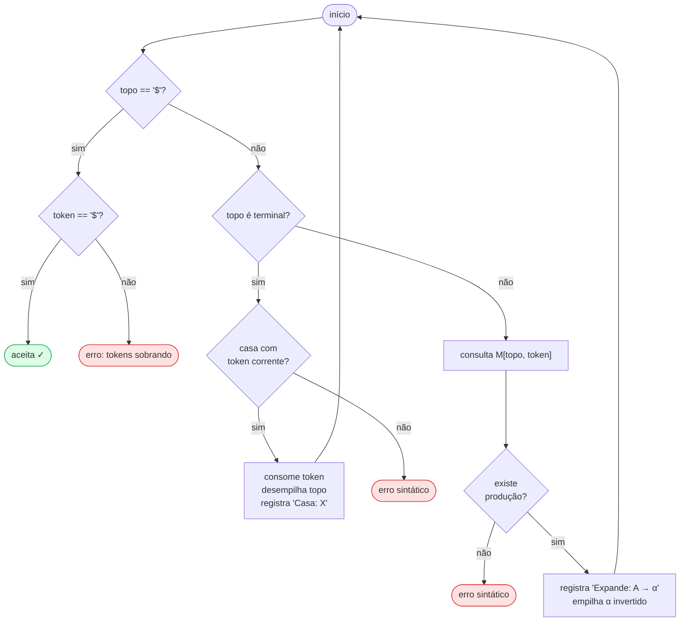

# RA2 9 — Analisador Sintático LL(1) com Geração de Assembly ARMv7

| | |
|---|---|
| **Instituição** | Pontifícia Universidade Católica do Paraná |
| **Disciplina** | Linguagens Formais e Compiladores |
| **Professor** | Frank Coelho de Alcantara |
| **Grupo Canvas** | RA2 9 |
| **Fase** | 2 — Analisador Sintático LL(1) |

### Integrantes
| Nome | Usuário GitHub |
|---|---|
| Arthur Felipe Bach Biancolini | Tuizones |
| Emanuel Riceto da Silva | emanuelriceto |
| Frederico Virmond Fruet | fredfruet |

> **Índice rápido:**
> [O que o projeto faz](#1-o-que-o-projeto-faz) ·
> [Pipeline](#2-pipeline-end-to-end) ·
> [Estrutura de arquivos](#3-estrutura-do-repositório) ·
> [A linguagem](#4-a-linguagem) ·
> [Como executar](#5-como-executar) ·
> [Gramática LL(1)](#6-gramática-ll1) ·
> [FIRST e FOLLOW](#7-conjuntos-first-e-follow) ·
> [Tabela de Análise](#8-tabela-de-análise-ll1) ·
> [Como o parser funciona](#9-como-o-parser-funciona) ·
> [A AST](#10-a-árvore-sintática-ast) ·
> [Geração de Assembly](#11-geração-de-assembly) ·
> [Testes](#12-arquivos-de-teste) ·
> [Tratamento de erros](#13-tratamento-de-erros) ·
> [Distribuição do trabalho](#14-distribuição-do-trabalho) ·
> [Checklist](#15-checklist-do-enunciado)

---

## 1. O que o projeto faz

Este projeto é um **compilador completo de brinquedo**: lê um arquivo-fonte
escrito numa linguagem RPN (Notação Polonesa Reversa) personalizada, valida
a sintaxe com um **parser LL(1)**, constrói uma **Árvore Sintática Abstrata
(AST)** e gera **código Assembly ARMv7** pronto para rodar no simulador
[CPUlator DE1-SoC](https://cpulator.01xz.net/?sys=arm-de1soc).

### O que é LL(1)?

Um parser **LL(1)** lê a entrada da **esquerda para a direita** (*Left-to-right*),
produz uma derivação mais à **esquerda** (*Leftmost*) e precisa de apenas
**1 símbolo de lookahead** para decidir qual regra aplicar — sem retrocesso,
sem ambiguidade.

Ele usa uma **pilha** e uma **tabela de decisão** `M[não-terminal, terminal]`:

```
Pilha: [ program  $  ]     Token corrente: (
→ consulta M[program, (]  →  expande: program → LPAREN START RPAREN body
Pilha: [ LPAREN  START  RPAREN  body  $ ]
→ topo LPAREN casa com (   →  consome token
...
```

---

## 2. Pipeline end-to-end

Tudo que acontece ao rodar `python main.py teste1.txt`:


### Fluxo em palavras

1. **`lerArquivo`** — abre o `.txt`, ignora linhas em branco e comentários `#`.
2. **`tokenizar_linha`** — o AFD da Fase 1 classifica cada caractere em tokens
   (`NUMERO`, `IDENT`, `LPAREN`, operadores, keywords…).
3. **`lerTokens`** — relê os tokens do arquivo salvo (integração Fase 1 → Fase 2).
4. **`construirGramatica`** — monta as 32 produções, calcula FIRST e FOLLOW
   (algoritmo de ponto-fixo) e constrói a tabela LL(1).
5. **`parsear`** — roda o algoritmo de pilha, registrando cada passo.
6. **`gerarArvore`** — re-percorre os passos e constrói a AST semântica.
7. **`gerarAssembly`** — percorre a AST recursivamente emitindo instruções ARMv7.
8. Salva todos os artefatos em `output/`.

---

## 3. Estrutura do Repositório

```
.
├── main.py                              # Ponto de entrada (CLI)
├── README.md                            # Este arquivo
├── gramatica.md                         # Gramática formal (EBNF estendido)
├── docs/
│   └── diagramas.md                     # Diagramas Mermaid detalhados
│
├── teste1.txt                           # Programa de teste 1 (≥10 linhas)
├── teste2.txt                           # Programa de teste 2 (≥10 linhas)
├── teste3.txt                           # Programa de teste 3 (≥10 linhas)
├── teste_erro_lexico.txt                # Casos de erro léxico
├── teste_erro_sintatico.txt             # Casos de erro sintático
│
├── src/
│   ├── lexer_fsm.py                     # AFD tokenizador (Fase 1, reaproveitado)
│   ├── parser_ll1.py                    # Gramática + parser LL(1) + AST
│   ├── armv7_generator.py               # Gerador de Assembly ARMv7
│   └── pipeline.py                      # Funções obrigatórias do enunciado
│
├── tests/
│   ├── test_lexer.py                    # Testes do AFD léxico
│   └── test_pipeline.py                 # Testes do parser, AST e Assembly
│
└── output/                              # Artefatos da última execução
    ├── tokens_ultima_execucao.txt        # Tokens (TIPO:valor, um por linha)
    ├── derivacao_ultima_execucao.md      # Passo a passo da pilha LL(1)
    ├── arvore_ultima_execucao.json       # AST em JSON (consumível por Fase 3)
    ├── arvore_ultima_execucao.md         # AST em texto legível (markdown)
    ├── gramatica_dump.md                 # Produções + FIRST/FOLLOW + tabela
    └── ultima_execucao.s                 # Assembly ARMv7 pronto para o CPUlator
```

---

## 4. A Linguagem

Toda expressão é escrita em **Notação Polonesa Reversa (RPN)** entre parênteses:
`(operando1 operando2 operador)`. Um programa **sempre** começa com `(START)`
e termina com `(END)` — uma instrução por linha.

### 4.1. Operadores aritméticos

| Operador | Significado | Exemplo | Resultados |
|:---:|---|---|---|
| `+` | Adição | `(3 4 +)` | `7` |
| `-` | Subtração | `(10 3 -)` | `7` |
| `*` | Multiplicação | `(4 2.5 *)` | `10.0` |
| `\|` | Divisão **real** | `(10.0 4.0 \|)` | `2.5` |
| `/` | Divisão **inteira** | `(10 3 /)` | `3` |
| `%` | Resto da divisão inteira | `(10 3 %)` | `1` |
| `^` | Potenciação | `(2 5 ^)` | `32` |

> **Por que `|` para divisão real?** O `/` já estava em uso como divisão inteira
> desde a Fase 1. Escolhemos `|` como alternativa visual — ambos são "barras".

### 4.2. Operadores relacionais

Retornam `1.0` (verdadeiro) ou `0.0` (falso), usados como condição nas
estruturas de controle.

| Operador | Significado | Exemplo |
|:---:|---|---|
| `>` | maior que | `((VARA) 0 >)` |
| `<` | menor que | `((X) 10 <)` |
| `==` | igual | `((FLAG) 1 ==)` |
| `!=` | diferente | `((CONT) 0 !=)` |
| `>=` | maior ou igual | `((VARA) 5 >=)` |
| `<=` | menor ou igual | `((N) 100 <=)` |

### 4.3. Comandos especiais

| Forma | Significado |
|---|---|
| `(V MEM)` | Armazena o valor `V` na memória chamada `MEM` |
| `(MEM)` | Lê o valor de `MEM` (retorna `0` se não inicializada) |
| `(N RES)` | Recupera o resultado da expressão `N` linhas atrás |

`MEM` é qualquer sequência de **letras maiúsculas** (`VARA`, `CONT`, `X`, `FLAG`…).
`RES` é palavra-reservada.

### 4.4. Estruturas de controle (definidas pelo grupo)

Usamos **palavras-chave no final** da expressão (estilo pós-fixado), o que
preserva o padrão RPN da linguagem e permite decisão com **1 símbolo de lookahead**.

| Estrutura | Sintaxe | Semântica |
|---|---|---|
| **IF** | `(COND BLOCO IF)` | Executa `BLOCO` se `COND ≠ 0` |
| **IFELSE** | `(COND THEN ELSE IFELSE)` | Executa `THEN` se `COND ≠ 0`, senão `ELSE` |
| **WHILE** | `(COND BLOCO WHILE)` | Repete `BLOCO` enquanto `COND ≠ 0` |

`COND`, `BLOCO`, `THEN` e `ELSE` são **expressões RPN válidas** (inclusive aninhadas).

**Exemplo completo** (retirado de `teste1.txt`):

```
(START)
(20 VARA)
(((VARA) 0 >)  ((VARA) 1 -) WHILE)
(((VARA) 5 >=) (1 FLAG) (0 FLAG) IFELSE)
(END)
```

### 4.5. Exemplo de aninhamento

```
((A (C D *) +))     → soma A com o produto de C e D
(((A B %) (D E *) /))  → divide o resto de A%B pelo produto D*E
```

---

## 5. Como Executar

### 5.1. Pré-requisitos

- **Python 3.10+** (nenhuma dependência externa)
- Para lint: `pip install ruff`
- Para testes: `pip install pytest` (ou use `python -m pytest`)

### 5.2. Executar o analisador

```bash
python main.py teste1.txt
```

Saída no console:

```
Linha 1: operação binária (+)
Linha 2: operação binária (-)
...
Árvore Sintática:
program
  binary(+)
    number(10)
    number(3)
  ...

Gramática salva em    : output/gramatica_dump.md
Tokens salvos em      : output/tokens_ultima_execucao.txt
Derivação salva em    : output/derivacao_ultima_execucao.md
Árvore salva em       : output/arvore_ultima_execucao.json + arvore_ultima_execucao.md
Assembly gerado em    : output/ultima_execucao.s
```

### 5.3. Artefatos gerados

| Arquivo | Formato | Conteúdo |
|---|---|---|
| `tokens_ultima_execucao.txt` | texto | `linha_N;TIPO:valor,...` |
| `derivacao_ultima_execucao.md` | markdown | tabela passo a passo da pilha LL(1) |
| `arvore_ultima_execucao.json` | JSON | AST completa (usável na Fase 3) |
| `arvore_ultima_execucao.md` | markdown | AST em texto indentado |
| `gramatica_dump.md` | markdown | produções + FIRST/FOLLOW + tabela LL(1) |
| `ultima_execucao.s` | Assembly | código ARMv7 para o CPUlator |

### 5.4. Argumentos opcionais

```bash
python main.py teste2.txt \
  --out output/teste2.s \
  --tokens-out output/tokens_t2.txt \
  --arvore-out output/arvore_t2.json \
  --derivacao-out output/derivacao_t2.md \
  --gramatica-out output/gramatica_t2.md
```

### 5.5. Rodar os testes automatizados

```bash
python -m pytest tests/ -v
```

Resultado esperado: **37 testes**, todos passando.

### 5.6. Executar o Assembly no CPUlator

1. Abrir <https://cpulator.01xz.net/?sys=arm-de1soc>
2. Colar o conteúdo de `output/ultima_execucao.s` no editor
3. Pressionar **F7** (Compilar) e depois **F5** (Executar)
4. O resultado da última expressão aparece no display **HEX3–HEX0**

---

## 6. Gramática LL(1)

Convenção: **minúsculas** = não-terminais · **MAIÚSCULAS** = terminais · `ε` = cadeia vazia

### 6.1. Regras de Produção

| # | Não-Terminal | Produção | Observação |
|:---:|---|---|---|
| 00 | `program` | `LPAREN START RPAREN body` | raiz — toda entrada começa com `(START)` |
| 01 | `body` | `LPAREN body_tail` | consome `(` antes de decidir |
| 02 | `body_tail` | `END RPAREN` | fim do programa |
| 03 | `body_tail` | `expr_body RPAREN body` | mais uma instrução + continua |
| 04 | `expr_body` | `item rest1` | pelo menos 1 item por expressão |
| 05 | `rest1` | `ε` | expressão de 1 item: `(MEM)` |
| 06 | `rest1` | `item rest2` | expressão de 2+ itens |
| 07 | `rest2` | `ε` | — |
| 08 | `rest2` | `binop` | operador binário aritmético/relacional |
| 09 | `rest2` | `kw_ctrl3` | keyword com 2 operandos (IF, WHILE) |
| 10 | `rest2` | `item item_tail` | 3 itens → IFELSE |
| 11 | `item_tail` | `kw_ctrl4` | keyword com 3 operandos (IFELSE) |
| 12 | `item` | `NUMERO` | literal numérico |
| 13 | `item` | `IDENT` | identificador de memória |
| 14 | `item` | `RES` | palavra-chave RES |
| 15 | `item` | `LPAREN expr_body RPAREN` | sub-expressão aninhada |
| 16–22 | `binop` | `+` `-` `*` `/` `\|` `%` `^` | aritméticos |
| 23–28 | `binop` | `>` `<` `==` `!=` `>=` `<=` | relacionais |
| 29 | `kw_ctrl3` | `IF` | |
| 30 | `kw_ctrl3` | `WHILE` | |
| 31 | `kw_ctrl4` | `IFELSE` | |

### 6.2. Por que essa gramática é LL(1)?

Três decisões de projeto garantem que nunca há conflito:

**1. Fatoração à esquerda em `body`**

Sem fatoração, `body_tail` teria dois casos começando com `(`:
`(END)` e `(expressão…)`. Com a regra `body → LPAREN body_tail`,
consumimos o `(` primeiro e só então olhamos se o próximo token é `END`
ou início de expressão — 1 símbolo resolve.

**2. `rest1` e `rest2` anuláveis apenas quando necessário**

`rest1` vai para `ε` somente quando vê `)` (expressão de 1 item, ex: `(MEM)`).
Em qualquer outro caso, expande para `item rest2`. Sem ambiguidade.

**3. Palavra-chave final para estruturas de controle**

`IF`, `WHILE` e `IFELSE` aparecem **no final** da expressão pós-fixada.
Quando o parser está em `rest2`, um único lookahead distingue:
- operador aritmético/relacional → `binop`
- `IF` ou `WHILE` → `kw_ctrl3`
- outro item (terá `IFELSE` depois) → `item item_tail`

A própria função `construirGramatica()` detecta conflitos em tempo de execução:
se uma célula da tabela recebesse 2 produções, lançaria `Erros("Conflito LL(1)")`.

---

## 7. Conjuntos FIRST e FOLLOW

> **FIRST(A)** = conjunto de terminais que podem **iniciar** uma derivação a partir de `A`.
> **FOLLOW(A)** = conjunto de terminais que podem **aparecer imediatamente após** `A`.
> Ambos são calculados por algoritmo de ponto-fixo em `construirGramatica()`.

### FIRST

| Não-Terminal | FIRST |
|---|---|
| `program` | `{` `(` `}` |
| `body` | `{` `(` `}` |
| `body_tail` | `{` `(`, `END`, `IDENT`, `NUMERO`, `RES` `}` |
| `expr_body` | `{` `(`, `IDENT`, `NUMERO`, `RES` `}` |
| `item` | `{` `(`, `IDENT`, `NUMERO`, `RES` `}` |
| `rest1` | `{` `(`, `IDENT`, `NUMERO`, `RES`, `ε` `}` |
| `rest2` | `{` `(`, `IDENT`, `IF`, `NUMERO`, `RES`, `WHILE`, `!=`, `%`, `*`, `+`, `-`, `/`, `<`, `<=`, `==`, `>`, `>=`, `^`, `\|`, `ε` `}` |
| `item_tail` | `{` `IFELSE` `}` |
| `binop` | `{` `!=`, `%`, `*`, `+`, `-`, `/`, `<`, `<=`, `==`, `>`, `>=`, `^`, `\|` `}` |
| `kw_ctrl3` | `{` `IF`, `WHILE` `}` |
| `kw_ctrl4` | `{` `IFELSE` `}` |

### FOLLOW

| Não-Terminal | FOLLOW |
|---|---|
| `program` | `{` `$` `}` |
| `body` | `{` `$` `}` |
| `body_tail` | `{` `$` `}` |
| `expr_body` | `{` `)` `}` |
| `item` | `{` `(`, `)`, `IDENT`, `IF`, `IFELSE`, `NUMERO`, `RES`, `WHILE`, `!=`, `%`, `*`, `+`, `-`, `/`, `<`, `<=`, `==`, `>`, `>=`, `^`, `\|` `}` |
| `rest1` | `{` `)` `}` |
| `rest2` | `{` `)` `}` |
| `item_tail` | `{` `)` `}` |
| `binop` | `{` `)` `}` |
| `kw_ctrl3` | `{` `)` `}` |
| `kw_ctrl4` | `{` `)` `}` |

---

## 8. Tabela de Análise LL(1)

Cada célula `M[A, a]` indica qual produção aplicar quando o **topo da pilha** é o
não-terminal `A` e o **token corrente** é `a`. Células não listadas = **erro sintático**.

A tabela completa com as 57 entradas é gerada automaticamente a cada execução em
[`output/gramatica_dump.md`](output/gramatica_dump.md). As entradas mais importantes:

| M\[A, a\] | Produção |
|---|---|
| `M[program, (]` | `program → LPAREN START RPAREN body` |
| `M[body, (]` | `body → LPAREN body_tail` |
| `M[body_tail, END]` | `body_tail → END RPAREN` |
| `M[body_tail, ( / NUMERO / IDENT / RES]` | `body_tail → expr_body RPAREN body` |
| `M[expr_body, ( / NUMERO / IDENT / RES]` | `expr_body → item rest1` |
| `M[rest1, )]` | `rest1 → ε` |
| `M[rest1, ( / NUMERO / IDENT / RES]` | `rest1 → item rest2` |
| `M[rest2, )]` | `rest2 → ε` |
| `M[rest2, + / - / * / … (operadores)]` | `rest2 → binop` |
| `M[rest2, IF / WHILE]` | `rest2 → kw_ctrl3` |
| `M[rest2, ( / NUMERO / IDENT / RES]` | `rest2 → item item_tail` |
| `M[item_tail, IFELSE]` | `item_tail → kw_ctrl4` |
| `M[item, NUMERO]` | `item → NUMERO` |
| `M[item, IDENT]` | `item → IDENT` |
| `M[item, RES]` | `item → RES` |
| `M[item, (]` | `item → LPAREN expr_body RPAREN` |

---

## 9. Como o Parser Funciona

### 9.1. O algoritmo de pilha

```python
gram   = construirGramatica()         # gramática + FIRST/FOLLOW + tabela
tokens = lerTokens("output/tokens_ultima_execucao.txt")
result = parsear(tokens, gram)        # derivação LL(1)
arv    = gerarArvore(result)          # AST semântica
asm    = gerarAssembly(arv)           # código ARMv7
```

Internamente, `parsear` mantém:
- **pilha** inicializada com `["program", "$"]`
- **buffer de tokens** terminado com `$`

A cada iteração:



### 9.2. Exemplo passo a passo

Para `(START) (3 4 +) (END)`:

| Passo | Pilha (topo →) | Token | Ação |
|:---:|---|---|---|
| 1 | `program $` | `(` | Expande: `program → LPAREN START RPAREN body` |
| 2 | `LPAREN START RPAREN body $` | `(` | Casa: `LPAREN` |
| 3 | `START RPAREN body $` | `START` | Casa: `START` |
| 4 | `RPAREN body $` | `)` | Casa: `RPAREN` |
| 5 | `body $` | `(` | Expande: `body → LPAREN body_tail` |
| 6 | `LPAREN body_tail $` | `(` | Casa: `LPAREN` |
| 7 | `body_tail $` | `3` | Expande: `body_tail → expr_body RPAREN body` |
| … | … | … | … |

O passo a passo completo da última execução está em
[`output/derivacao_ultima_execucao.md`](output/derivacao_ultima_execucao.md).

### 9.3. Da derivação para a AST

A AST **não** é construída durante o parsing — ela é reconstruída depois,
percorrendo a lista de passos gravada. Isso separa responsabilidades: `parsear()`
é puro (sem efeitos colaterais), e `gerarArvore()` pode ser testado isoladamente.

---

## 10. A Árvore Sintática (AST)

### 10.1. Tipos de nó

| Tipo | Campos | Representa |
|---|---|---|
| `program` | `stmts: [nó, …]` | raiz — lista de instruções do programa |
| `binary` | `op`, `esq`, `dir` | operação binária aritmética ou relacional |
| `number` | `valor` | literal numérico (`10`, `3.14`) |
| `mem_read` | `nome` | leitura de memória: `(MEM)` |
| `mem_write` | `nome`, `expr` | escrita em memória: `(V MEM)` |
| `res_ref` | `linhas_atras` | referência a resultado anterior: `(N RES)` |
| `if` | `cond`, `then_block` | `(COND BLOCO IF)` |
| `ifelse` | `cond`, `then_block`, `else_block` | `(COND THEN ELSE IFELSE)` |
| `while` | `cond`, `body` | `(COND BLOCO WHILE)` |

### 10.2. Estrutura em JSON

```json
{
  "tipo": "program",
  "stmts": [
    { "tipo": "binary", "op": "+",
      "esq": { "tipo": "number", "valor": 10 },
      "dir": { "tipo": "number", "valor": 3 } },
    { "tipo": "while",
      "cond": { "tipo": "binary", "op": ">",
                "esq": { "tipo": "mem_read", "nome": "VARA" },
                "dir": { "tipo": "number", "valor": 0 } },
      "body": { "tipo": "binary", "op": "-",
                "esq": { "tipo": "mem_read", "nome": "VARA" },
                "dir": { "tipo": "number", "valor": 1 } } }
  ]
}
```

O JSON completo da última execução está em
[`output/arvore_ultima_execucao.json`](output/arvore_ultima_execucao.json).

### 10.3. Árvore do último teste (`teste1.txt`)

```
program
  binary(+)
    number(10)
    number(3)
  binary(-)
    number(7.5)
    number(2.5)
  binary(*)
    number(4)
    number(2.5)
  binary(|)
    number(10.0)
    number(4.0)
  binary(/)
    number(10)
    number(3)
  binary(%)
    number(10)
    number(3)
  binary(^)
    number(2)
    number(5)
  mem_write(VARA)
    number(20)
  binary(|)
    mem_read(VARA)
    number(2)
  res_ref(linhas_atras=2)
  while
    cond:
      binary(>)
        mem_read(VARA)
        number(0)
    body:
      binary(-)
        mem_read(VARA)
        number(1)
  ifelse
    cond:
      binary(>=)
        mem_read(VARA)
        number(5)
    then:
      mem_write(FLAG)
        number(1)
    else:
      mem_write(FLAG)
        number(0)
  binary(==)
    mem_read(FLAG)
    number(0)
  binary(-)
    binary(+)
      number(10)
      number(3)
    binary(*)
      number(2)
      number(4)
```

---

## 11. Geração de Assembly

### 11.1. Estratégia geral

A geração percorre a AST **recursivamente**. Todos os valores são tratados como
`double` IEEE 754 (64 bits) usando os registradores VFP `d0`–`d7`.

Como o ARMv7 não tem `PUSH`/`POP` para registradores VFP diretamente,
usamos o par `r4:r5` como intermediário:

```asm
@ empilhar d0:
VMOV r4, r5, d0
PUSH {r4, r5}

@ desempilhar para d1:
POP {r4, r5}
VMOV d1, r4, r5
```

### 11.2. Como cada nó é traduzido

| Nó da AST | Assembly gerado |
|---|---|
| `number(N)` | `VLDR.F64 d0, =const_N` → empilha |
| `mem_read(MEM)` | `LDR r0, =mem_MEM` · `VLDR.F64 d0, [r0]` → empilha |
| `mem_write(MEM, e)` | gera `e` → desempilha → `VSTR.F64 d0, [mem_MEM]` |
| `res_ref(N)` | `LDR r0, =resultado_(linha-N)` · `VLDR.F64 d0, [r0]` |
| `binary(+)` | gera esq+dir → `VADD.F64 d0, d0, d1` |
| `binary(-)` | idem → `VSUB.F64 d0, d0, d1` |
| `binary(*)` | idem → `VMUL.F64 d0, d0, d1` |
| `binary(\|)` | idem → `VDIV.F64 d0, d0, d1` (divisão real) |
| `binary(/)` | idem → chama `__op_idiv` (divisão inteira) |
| `binary(%)` | idem → chama `__op_mod` |
| `binary(^)` | idem → chama `__op_pow` (multiplicação iterativa) |
| `binary(> < == …)` | `VCMP.F64 d0, d1` · `VMRS APSR_nzcv, FPSCR` · desvio condicional → empilha `1.0` ou `0.0` |
| `if` | gera cond → `VCMP` → `BEQ fim_X` → gera bloco → `fim_X:` |
| `ifelse` | gera cond → `BEQ else_X` → then → `B fim_X` → `else_X:` → else → `fim_X:` |
| `while` | `loop_X:` → gera cond → `BEQ fim_X` → bloco → `B loop_X` → `fim_X:` |

### 11.3. Rotinas auxiliares

As operações sem instrução nativa em ARMv7 são implementadas como sub-rotinas:

| Rotina | Função |
|---|---|
| `__op_idiv` | divisão inteira: converte `double→int`, divide, volta para `double` |
| `__op_mod` | resto: divide e subtrai `quociente × divisor` |
| `__op_pow` | potência com expoente inteiro (laço de multiplicações) |
| `__sdiv32` | divisão de 32 bits por subtrações (Cortex-A9 não tem `SDIV`) |
| `__exibir_hex` | exibe inteiro nos 6 displays HEX do DE1-SoC |

---

## 12. Arquivos de Teste

Cada arquivo tem **mais de 10 linhas** e cumpre todos os requisitos do enunciado:

| Requisito | teste1 | teste2 | teste3 |
|---|:---:|:---:|:---:|
| Todos os operadores `+ - * \| / % ^` | ✅ | ✅ | ✅ |
| Comandos `(N RES)`, `(V MEM)`, `(MEM)` | ✅ | ✅ | ✅ |
| Estrutura de **decisão** (`IF` / `IFELSE`) | ✅ | ✅ | ✅ |
| Estrutura de **repetição** (`WHILE`) | ✅ | ✅ | ✅ |
| Literais inteiros, reais e variáveis | ✅ | ✅ | ✅ |
| Aninhamento profundo | ✅ | ✅ | ✅ |

Para validar o tratamento de erros:

| Arquivo | Erros cobertos |
|---|---|
| [`teste_erro_lexico.txt`](teste_erro_lexico.txt) | `&`, `3.14.5`, `.5`, `10x`, `Mem` (minúscula), `=` sozinho, `!` sozinho, `MEM1` (dígito) |
| [`teste_erro_sintatico.txt`](teste_erro_sintatico.txt) | `(3 2 + 5)`, `(+ 3 2)`, `(IF 3 2)`, parênteses extras, `(1 RES MEM)` |

```bash
python main.py teste_erro_lexico.txt     # aborta na primeira linha problemática
python main.py teste_erro_sintatico.txt
```

Os testes unitários em [`tests/`](tests/) cobrem:

- Tokens léxicos inválidos (`@`, `&`, números malformados)
- Programas sem `(START)` ou sem `(END)`
- Estruturas de controle malformadas
- Aninhamento profundo e expressões vazias
- Pipeline completo com os 3 arquivos de teste

---

## 13. Tratamento de Erros

Toda mensagem inclui **linha** e **coluna** quando disponível:

| Origem | Exemplo de mensagem |
|---|---|
| Lexer | `linha 4, col 7: caractere inválido '@'` |
| Parser | `linha 6: token inesperado 'IF' — esperado {RPAREN, +, -, …}` |
| Parser | `programa não inicia com (START)` |
| Parser | `programa não termina com (END)` |
| Semântico | `RES inválido: 5 linhas atrás não disponível` |

A classe `Erros` (em [`src/lexer_fsm.py`](src/lexer_fsm.py)) é compartilhada por
todos os módulos, mantendo o `try/except` em `main.py` simples.

---

## 14. Distribuição do Trabalho

| Aluno | Responsabilidades | Arquivos |
|---|---|---|
| **Frederico** (fredfruet) | `construirGramatica`, FIRST/FOLLOW, tabela LL(1), `parsear` | [`src/parser_ll1.py`](src/parser_ll1.py), [`gramatica.md`](gramatica.md), [`tests/test_pipeline.py`](tests/test_pipeline.py) |
| **Emanuel** (emanuelriceto) | `lerTokens`, novas keywords e relacionais no AFD, testes léxicos | [`src/lexer_fsm.py`](src/lexer_fsm.py), [`src/pipeline.py`](src/pipeline.py), [`tests/test_lexer.py`](tests/test_lexer.py) |
| **Arthur** (Tuizones) | `gerarArvore`, `gerarAssembly`, `main`, integração end-to-end | [`main.py`](main.py), [`src/armv7_generator.py`](src/armv7_generator.py) |

Cada contribuição está registrada no repositório como **pull request separado**.


## 15. Referências

- AHO, A. V.; LAM, M. S.; SETHI, R.; ULLMAN, J. D. **Compiladores: princípios, técnicas e ferramentas**. 2ª ed. Pearson, 2008.
- ARM Architecture Reference Manual — ARMv7-A and ARMv7-R edition.
- CPUlator DE1-SoC — <https://cpulator.01xz.net>.
