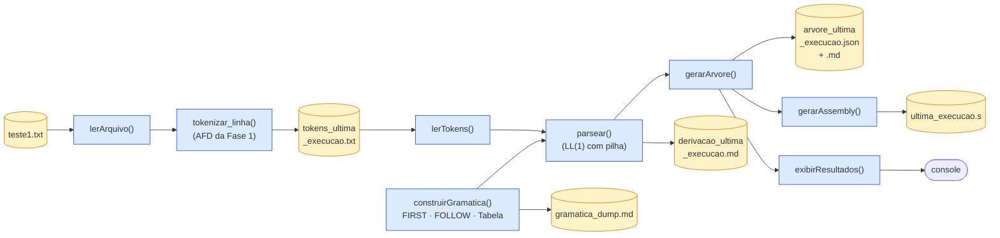
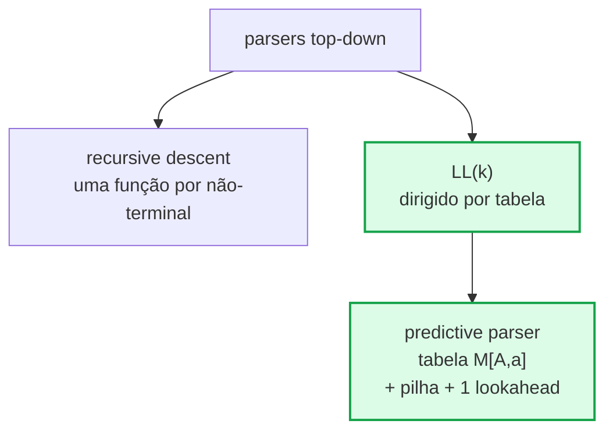
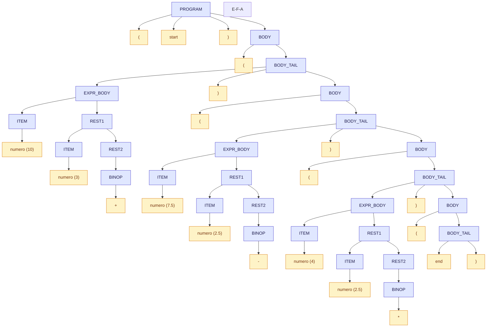

# RA2 9 — Analisador Sintático LL(1) com Geração de Assembly ARMv7

| | |
|---|---|
| **Instituição** | Pontifícia Universidade Católica do Paraná |
| **Disciplina** | Linguagens Formais e Compiladores |
| **Professor** | Frank Coelho de Alcantara |
| **Grupo Canvas** | RA2 9 |
| **Fase** | 2 Analisador Sintático LL(1) |
| **Ano/Semestre** | 2026 / 1° Semestre |
|||

### Integrantes
| Nome | Usuário GitHub |
|---|---|
| Arthur Felipe Bach Biancolini | Tuizones |
| Emanuel Riceto da Silva | emanuelriceto |
| Frederico Virmond Fruet | fredfruet |

> **Índice rápido:**
> [O que o projeto faz](#1-o-que-o-projeto-faz) ·
> [Pipeline](#2-pipeline-end-to-end) ·
> [Estrutura de arquivos](#3-estrutura-do-repositório) ·
> [A linguagem](#4-a-linguagem) ·
> [Como executar](#5-como-executar) ·
> [API das funções](#6-api--assinaturas-das-funções) ·
> [Gramática LL(1)](#7-gramática-ll1) ·
> [Fundamentos teóricos *(opcional)*](#8-fundamentos-teóricos--por-que-ll1) ·
> [FIRST e FOLLOW](#9-conjuntos-first-e-follow) ·
> [Tabela de Análise](#10-tabela-de-análise-ll1) ·
> [Como o parser funciona](#11-como-o-parser-funciona) ·
> [A AST](#12-a-árvore-sintática-ast) ·
> [Geração de Assembly](#13-geração-de-assembly) ·
> [Testes](#14-arquivos-de-teste) ·
> [Tratamento de erros](#15-tratamento-de-erros) ·
> [Distribuição do trabalho](#16-distribuição-do-trabalho) ·
> [Referências](#17-referências)

---

## 1. O que o projeto faz

Este projeto é um **Compilador**: lê um arquivo-fonte
escrito numa linguagem RPN (Notação Polonesa Reversa) personalizada, valida
a sintaxe com um **parser LL(1)**, constrói uma **Árvore Sintática Abstrata
(AST)** e gera **código Assembly ARMv7** pronto para rodar no simulador
[CPUlator DE1-SoC](https://cpulator.01xz.net/?sys=arm-de1soc).

### O que é LL(1)?

Um parser **LL(1)** lê a entrada da **esquerda para a direita** (*Left-to-right*),
produz uma derivação mais à **esquerda** (*Leftmost*) e precisa de apenas
**1 símbolo de lookahead** para decidir qual regra aplicar — sem retrocesso,
sem ambiguidade.

Ele usa uma **pilha** e uma **tabela de decisão** `M[não-terminal, terminal]`:

```
Pilha: [ PROGRAM  $  ]     Token corrente: (
→ consulta M[PROGRAM, (]  →  expande: PROGRAM → "(" start ")" BODY
Pilha: [ "(" start ")" BODY $ ]
→ topo "(" casa com (   →  consome token
→ topo start  casa com lexema START   → consome
...
```

---

---

## 2. Pipeline end-to-end

Tudo que acontece ao rodar `python main.py teste1.txt`:



### Fluxo em palavras

1. **`lerArquivo`** — abre o `.txt`, ignora linhas em branco e comentários `#`.
2. **`tokenizar_linha`** — o AFD da Fase 1 classifica cada caractere em tokens
   (`NUMERO`, `IDENT`, `LPAREN`, operadores, keywords…).
3. **`lerTokens`** — relê os tokens do arquivo salvo (integração Fase 1 → Fase 2).
4. **`construirGramatica`** — monta as 32 produções, calcula FIRST e FOLLOW
   (algoritmo de ponto-fixo) e constrói a tabela LL(1).
5. **`parsear`** — roda o algoritmo de pilha, registrando cada passo.
6. **`gerarArvore`** — re-percorre os passos e constrói a AST semântica.
7. **`gerarAssembly`** — percorre a AST recursivamente emitindo instruções ARMv7.
8. Salva todos os artefatos em `output/`.

---

## 3. Estrutura do Repositório

```
.
├── main.py                              # Ponto de entrada (CLI)
├── README.md                            # Este arquivo
├── gramatica.md                         # Gramática formal (EBNF estendido)
├── docs/
│   └── diagramas.md                     # Diagramas Mermaid detalhados
│
├── teste1.txt                           # Programa de teste 1 (≥10 linhas)
├── teste2.txt                           # Programa de teste 2 (≥10 linhas)
├── teste3.txt                           # Programa de teste 3 (≥10 linhas)
├── teste_erro_lexico.txt                # Casos de erro léxico
├── teste_erro_sintatico.txt             # Casos de erro sintático
│
├── src/
│   ├── lexer_fsm.py                     # AFD tokenizador (Fase 1, reaproveitado)
│   ├── parser_ll1.py                    # Gramática + parser LL(1) + AST
│   ├── armv7_generator.py               # Gerador de Assembly ARMv7
│   └── pipeline.py                      # Funções obrigatórias do enunciado
│
├── tests/
│   ├── test_lexer.py                    # Testes do AFD léxico
│   └── test_pipeline.py                 # Testes do parser, AST e Assembly
│
└── output/                              # Artefatos da última execução
    ├── tokens_ultima_execucao.txt        # Tokens (TIPO:valor, um por linha)
    ├── derivacao_ultima_execucao.md      # Passo a passo da pilha LL(1)
    ├── arvore_ultima_execucao.json       # AST em JSON (consumível por Fase 3)
    ├── arvore_ultima_execucao.md         # AST em texto legível (markdown)
    ├── gramatica_dump.md                 # Produções + FIRST/FOLLOW + tabela
    └── ultima_execucao.s                 # Assembly ARMv7 pronto para o CPUlator
```

---

## 4. A Linguagem

Toda expressão é escrita em **Notação Polonesa Reversa (RPN)** entre parênteses:
`(operando1 operando2 operador)`. Um programa **sempre** começa com `(START)`
e termina com `(END)` — uma instrução por linha.

### 4.1. Operadores aritméticos

| Operador | Significado | Exemplo | Resultados |
|:---:|---|---|---|
| `+` | Adição | `(3 4 +)` | `7` |
| `-` | Subtração | `(10 3 -)` | `7` |
| `*` | Multiplicação | `(4 2.5 *)` | `10.0` |
| `\|` | Divisão **real** | `(10.0 4.0 \|)` | `2.5` |
| `/` | Divisão **inteira** | `(10 3 /)` | `3` |
| `%` | Resto da divisão inteira | `(10 3 %)` | `1` |
| `^` | Potenciação | `(2 5 ^)` | `32` |


### 4.2. Operadores relacionais

Retornam `1.0` (verdadeiro) ou `0.0` (falso), usados como condição nas
estruturas de controle.

| Operador | Significado | Exemplo |
|:---:|---|---|
| `>` | maior que | `((VARA) 0 >)` |
| `<` | menor que | `((X) 10 <)` |
| `==` | igual | `((FLAG) 1 ==)` |
| `!=` | diferente | `((CONT) 0 !=)` |
| `>=` | maior ou igual | `((VARA) 5 >=)` |
| `<=` | menor ou igual | `((N) 100 <=)` |

### 4.3. Comandos especiais

| Forma | Significado |
|---|---|
| `(V MEM)` | Armazena o valor `V` na memória chamada `MEM` |
| `(MEM)` | Lê o valor de `MEM` (retorna `0` se não inicializada) |
| `(N RES)` | Recupera o resultado da expressão `N` linhas atrás |

`MEM` é qualquer sequência de **letras maiúsculas** (`VARA`, `CONT`, `X`, `FLAG`…).
`RES` é palavra-reservada.

### 4.4. Estruturas de controle (definidas pelo grupo)

Usamos **palavras-chave no final** da expressão (estilo pós-fixado), o que
preserva o padrão RPN da linguagem e permite decisão com **1 símbolo de lookahead**.

| Estrutura | Sintaxe | Semântica |
|---|---|---|
| **IF** | `(COND BLOCO IF)` | Executa `BLOCO` se `COND ≠ 0` |
| **IFELSE** | `(COND THEN ELSE IFELSE)` | Executa `THEN` se `COND ≠ 0`, senão `ELSE` |
| **WHILE** | `(COND BLOCO WHILE)` | Repete `BLOCO` enquanto `COND ≠ 0` |

`COND`, `BLOCO`, `THEN` e `ELSE` são **expressões RPN válidas** (inclusive aninhadas).

**Exemplo completo** (retirado de `teste1.txt`):

```
(START)
(20 VARA)
(((VARA) 0 >)  ((VARA) 1 -) WHILE)
(((VARA) 5 >=) (1 FLAG) (0 FLAG) IFELSE)
(END)
```

### 4.5. Exemplo de aninhamento

```
((A (C D *) +))     → soma A com o produto de C e D
(((A B %) (D E *) /))  → divide o resto de A%B pelo produto D*E
```

---

## 5. Como Executar

### 5.1. Pré-requisitos

- **Python 3.10+** (nenhuma dependência externa)
- Para testes: `pip install pytest` (ou use `python -m pytest`)

### 5.2. Executar o analisador

```bash
python main.py teste1.txt
```

Saída no console:

```
Linha 1: operação binária (+)
Linha 2: operação binária (-)
...
Árvore Sintática:
program
  binary(+)
    number(10)
    number(3)
  ...

Gramática salva em    : output/gramatica_dump.md
Tokens salvos em      : output/tokens_ultima_execucao.txt
Derivação salva em    : output/derivacao_ultima_execucao.md
Árvore salva em       : output/arvore_ultima_execucao.json + arvore_ultima_execucao.md
Assembly gerado em    : output/ultima_execucao.s
```

### 5.3. Artefatos gerados

| Arquivo | Formato | Conteúdo |
|---|---|---|
| `tokens_ultima_execucao.txt` | texto | `linha_N;TIPO:valor,...` |
| `derivacao_ultima_execucao.md` | markdown | tabela passo a passo da pilha LL(1) |
| `arvore_ultima_execucao.json` | JSON | AST completa (usável na Fase 3) |
| `arvore_ultima_execucao.md` | markdown | AST em texto indentado |
| `gramatica_dump.md` | markdown | produções + FIRST/FOLLOW + tabela LL(1) |
| `ultima_execucao.s` | Assembly | código ARMv7 para o CPUlator |

### 5.4. Argumentos opcionais

```bash
python main.py teste2.txt \
  --out output/teste2.s \
  --tokens-out output/tokens_t2.txt \
  --arvore-out output/arvore_t2.json \
  --derivacao-out output/derivacao_t2.md \
  --gramatica-out output/gramatica_t2.md
```

### 5.5. Rodar os testes automatizados

```bash
python -m pytest tests/ -v
```

Resultado esperado: **37 testes**, todos passando.

### 5.6. Executar o Assembly no CPUlator

1. Abrir <https://cpulator.01xz.net/?sys=arm-de1soc>
2. Colar o conteúdo de `output/ultima_execucao.s` no editor
3. Pressionar **F7** (Compilar) e depois **F5** (Executar)
4. O resultado da última expressão aparece no display **HEX3–HEX0**

---

## 6. API — Assinaturas das Funções

Referência rápida de **o que cada função recebe e devolve**, com exemplos reais do projeto.

### Léxico — `src/lexer_fsm.py`

```python
@dataclass
class Token:
    tipo:   str   # "NUMERO" | "OPERADOR" | "PARENTESE_ABRE" | "PARENTESE_FECHA"
                  # | "KEYWORD" | "IDENTIFICADOR"
    valor:  str   # lexema exato
    linha:  int
    coluna: int
```

#### `tokenizar_linha(linha: str, numero_linha: int = 1) -> list[Token]`

**Recebe** uma linha de código e o número dela. **Devolve** a lista de `Token` daquela linha.

```python
>>> tokenizar_linha("(10 3 +)", numero_linha=1)
[Token('PARENTESE_ABRE',  '(',  1, 1),
 Token('NUMERO',          '10', 1, 2),
 Token('NUMERO',          '3',  1, 5),
 Token('OPERADOR',        '+',  1, 7),
 Token('PARENTESE_FECHA', ')',  1, 8)]
```

#### `tokenizar_programa(linhas: list[str]) -> list[Token]`

**Recebe** a lista de linhas do fonte. **Devolve** a lista **flat** de todos os tokens, com `linha` preservado.

---

### Pipeline — `src/pipeline.py`

#### `lerArquivo(nomeArquivo: str, linhas: list[str]) -> None`

**Recebe** o caminho do `.txt` e uma lista **mutável**. **Devolve** `None` — preenche `linhas` in-place, descartando comentários (`#`) e linhas em branco.

```python
linhas = []
lerArquivo("teste1.txt", linhas)
# linhas[0]  == "(START)"
# linhas[1]  == "(10 3 +)"
# len(linhas) == 16
```

#### `salvarTokens(caminho: str | Path, tokens_por_linha: list[list[Token]]) -> None`

**Recebe** o caminho de saída e uma **lista de listas de Token** (uma sub-lista por linha do fonte). **Devolve** `None` — grava o arquivo no formato `linha_N;TIPO:valor,...`.

#### `lerTokens(nomeArquivo: str) -> list[Token]`

**Recebe** o caminho de um arquivo gerado por `salvarTokens`. **Devolve** a lista flat de `Token` reconstruída.

#### `gerarAssembly(arvore_programa: dict) -> str`

**Recebe** a AST (`dict` com raiz `{"tipo": "program", "stmts": [...]}`). **Devolve** o código Assembly ARMv7 completo como string.

#### `exibirResultados(resultados: list[dict]) -> None`

**Recebe** uma lista de dicts com chave `"descricao"`. **Devolve** `None` — imprime `"Linha N: <descricao>"` para cada item.

#### `executar_fase2(caminho_fonte, caminho_tokens, caminho_asm, caminho_arvore) -> dict`

Orquestrador. **Recebe** quatro caminhos (todos `str`). **Devolve** um `dict` com **todas** as saídas intermediárias:

| Chave | Tipo | Conteúdo |
|---|---|---|
| `linhas` | `list[str]` | Linhas lidas (sem comentários) |
| `tokens` | `list[Token]` | Tokens flat |
| `gramatica` | `dict` | Saída de `construirGramatica()` |
| `derivacao` | `list[dict]` | Expansões LL(1) (leftmost) |
| `passos` | `list[dict]` | Log completo da pilha |
| `arvore` | `dict` | AST semântica |
| `assembly` | `str` | Código Assembly gerado |

---

### Parser — `src/parser_ll1.py`

#### `construirGramatica() -> dict`

**Recebe** nada (gramática fixa). **Devolve** um `dict` com 7 chaves:

| Chave | Tipo | Conteúdo |
|---|---|---|
| `producoes` | `list[tuple[str, list[str]]]` | 32 regras `(LHS, [símbolos])`, indexadas 0–31 |
| `nao_terminais` | `set[str]` | 11 não-terminais |
| `terminais` | `set[str]` | Vocabulário terminal + `"$"` |
| `inicial` | `str` | `"PROGRAM"` |
| `first` | `dict[str, set[str]]` | FIRST de cada não-terminal |
| `follow` | `dict[str, set[str]]` | FOLLOW de cada não-terminal |
| `tabela` | `dict[tuple[str, str], int]` | 57 entradas `{(NT, terminal): índice}` |

```python
>>> g = construirGramatica()
>>> g["producoes"][0]
('PROGRAM', ['(', 'start', ')', 'BODY'])
>>> g["tabela"][("ITEM", "numero")]
12
>>> g["tabela"][("REST2", "+")]
8
```

#### `parsear(tokens: list[Token], tabela_ll1: dict) -> dict`

**Recebe** a lista flat de tokens e o dict da gramática. **Devolve** `{"derivacao": list[dict], "passos": list[dict], "tokens": list[Token]}`. Lança `Erros` em caso de falha sintática.

```python
>>> r = parsear(tokens, g)
>>> r["derivacao"][0]
{'idx': 0, 'lhs': 'PROGRAM', 'rhs': ['(', 'start', ')', 'BODY']}
```

#### `gerarArvore(resultado_parse: dict) -> dict`

**Recebe** o dict de `parsear()` (usa apenas `"tokens"`). **Devolve** a AST semântica como dict aninhado (tipos em §12.1).

```python
>>> arv = gerarArvore(r)
>>> arv["stmts"][0]
{'tipo': 'binary', 'op': '+',
 'esq': {'tipo': 'number', 'valor': '10'},
 'dir': {'tipo': 'number', 'valor': '3'}}
```

---

## 7. Gramática LL(1)

Convenção (ISO/IEC 14977 — EBNF):
**MAIÚSCULAS** = não-terminais · **minúsculas** = categorias léxicas
terminais (`numero`, `ident`) · **literais entre aspas** = terminais
exatos (`"("`, `"+"`, `if`) · `[ ]` opcional · `{ }` repetição (0+) ·
`|` alternativa · `ε` = cadeia vazia · `$` = fim de entrada.

### 7.1. Forma EBNF (canônica)

#### Como ler EBNF (símbolos da meta-linguagem)

| Símbolo | Significado |
|:---:|---|
| `=` | "é definido como" — abre a regra |
| `,` | **e depois** (concatenação / sequência). **Não é "ou".** |
| `\|` | **ou** (alternativa) |
| `{ X }` | **zero ou mais** ocorrências de `X` (repetição) |
| `[ X ]` | **opcional** — zero ou uma ocorrência de `X` |
| `( ... )` | agrupamento |
| `"texto"` | terminal literal exato |
| `;` | fim da regra |

> **Atenção:** em EBNF a vírgula significa **concatenação**, não escolha.
> `A , B` = "primeiro A, depois B"; `A | B` = "A ou B".

#### A gramática

```ebnf
PROGRAM   = "(" start ")" , { "(" EXPR_BODY ")" } , "(" end ")" ;
EXPR_BODY = ITEM
          | ITEM , ITEM , [ TAIL ] ;
TAIL      = BINOP
          | KW_CTRL3
          | ITEM , KW_CTRL4 ;
ITEM      = numero | ident | res | "(" , EXPR_BODY , ")" ;
BINOP     = "+" | "-" | "*" | "/" | "|" | "%" | "^"
          | ">" | "<" | "==" | "!=" | ">=" | "<=" ;
KW_CTRL3  = if | while ;
KW_CTRL4  = ifelse ;
```

#### Lendo cada regra em português

- **`PROGRAM`** — *uma* sequência fixa: `(start)` no início, depois
  **zero ou mais** blocos `(EXPR_BODY)`, depois `(end)` no fim.
  Não é uma escolha entre alternativas — é a estrutura única e
  obrigatória de qualquer programa válido.
- **`EXPR_BODY`** — o conteúdo de um statement, *sem* os parênteses
  externos. Pode ser **1 item** isolado (forma `(MEM)`) ou **2 itens
  obrigatórios** seguidos de uma `TAIL` opcional.
- **`TAIL`** — o "verbo" de uma expressão pós-fixada: um operador
  binário, uma keyword de 2 operandos (`if`/`while`) ou um terceiro
  item seguido de `ifelse` (4 itens no total).
- **`ITEM`** — um operando: número, identificador de memória, a
  palavra-chave `res`, ou uma sub-expressão completa entre parênteses
  (recursão que permite aninhamento arbitrário).
- **`BINOP`, `KW_CTRL3`, `KW_CTRL4`** — apenas listas de tokens
  terminais; servem para agrupar e dar nome.

#### Exemplo: derivando `(START) (10 3 +) (END)`

```
PROGRAM
  = "(" start ")"  ,  { "(" EXPR_BODY ")" }  ,  "(" end ")"
                       └─ uma iteração ─┘
                       └ EXPR_BODY = 10 , 3 , (TAIL = BINOP = "+")
```

A repetição `{ ... }` deu **uma** volta (um único statement no meio);
poderia ter dado zero (`(START)(END)`) ou várias.

> **Nota sobre caixa.** Na convenção EBNF, **terminais** são minúsculos
> (`start`, `end`, `if`, `while`, `ifelse`, `res`, `numero`, `ident`)
> ou literais entre aspas (`"("`, `"+"`). No código-fonte do programa
> a ser parseado, esses lexemas continuam sendo escritos em **MAIÚSCULAS**
> (ex.: `(START)`, `(IF …)`) — a tabela em [§ 1.3 de `gramatica.md`](gramatica.md#13-mapeamento-literal--s%C3%ADmbolo-interno)
> faz o mapeamento `lexema MAIÚSCULO ↔ terminal minúsculo` que o
> [`_token_para_terminal`](src/parser_ll1.py) implementa no github <https://github.com/Tuizones/RA2_9/>

> **Por que ainda precisamos da BNF da § 7.2.** EBNF é ótima para
> humanos mas a tabela LL(1) só sabe consultar regras no formato
> `A → α` (sem `{ }` ou `[ ]`). Cada `{ ... }` e `[ ... ]` precisa ser
> traduzido para um novo não-terminal recursivo/anulável. Por exemplo,
> a repetição `{ "(" EXPR_BODY ")" } "(" end ")"` vira
> `BODY → "(" BODY_TAIL` com `BODY_TAIL` decidindo a cada iteração entre
> "acabou" (`end ")"`) e "vem mais um statement" (`EXPR_BODY ")" BODY`).
> Mesma informação, formato diferente.

### 7.2. Forma BNF fatorada (numerada — base da tabela LL(1))

> **Mapeamento EBNF ↔ BNF interna.** Os nomes na §7.1 (EBNF, voltada para
> humanos) e os nomes na tabela abaixo (BNF, consumida pela tabela LL(1))
> referem-se à **mesma gramática** — os símbolos extras existem só porque
> o formato BNF não tem `{ }` nem `[ ]` e precisa simular essas construções
> com não-terminais auxiliares.
>
> | Símbolo na EBNF (§7.1) | Símbolo(s) na BNF (§7.2) | Por que mudou |
> |---|---|---|
> | `PROGRAM` | `PROGRAM` + `BODY` + `BODY_TAIL` | a repetição `{ "(" EXPR_BODY ")" }` virou `BODY` recursivo, e `BODY → "(" BODY_TAIL` fatora o `(` comum entre "mais um statement" e `(end)` |
> | `EXPR_BODY` (1 ou 2+ itens) | `EXPR_BODY` + `REST1` (anulável) | `REST1 → ε` cobre o caso de 1 item; `REST1 → ITEM REST2` cobre 2+ |
> | `TAIL` (opcional após 2 itens) | `REST2` (anulável) | a opcionalidade `[ TAIL ]` virou `REST2 → ε \| BINOP \| KW_CTRL3 \| ITEM ITEM_TAIL` |
> | `ITEM , KW_CTRL4` (caminho do IFELSE) | `ITEM_TAIL → KW_CTRL4` | dá um nome próprio à "cauda" do IFELSE para que `REST2 → ITEM ITEM_TAIL` fique determinístico |
> | `ITEM`, `BINOP`, `KW_CTRL3`, `KW_CTRL4` | iguais | já estavam em forma BNF |
>
> Resumindo: `BODY`, `BODY_TAIL`, `REST1`, `REST2` e `ITEM_TAIL` **não são**
> conceitos novos — são apenas a forma "achatada" exigida pela tabela `M[A,a]`.


A EBNF acima é traduzida para BNF onde cada `[ ]` / `{ }` vira um
não-terminal anulável (`REST1`, `REST2`, `ITEM_TAIL`, `BODY`,
`BODY_TAIL`). Esta numeração `#0..#31` é a usada na tabela `M[A, a]`
e em `output/derivacao_ultima_execucao.md`.

| # | Não-Terminal | Produção | Observação |
|:---:|---|---|---|
| 00 | `PROGRAM` | `"(" start ")" BODY` | raiz — toda entrada começa com `(START)` |
| 01 | `BODY` | `"(" BODY_TAIL` | consome `(` antes de decidir (fatoração à esquerda) |
| 02 | `BODY_TAIL` | `end ")"` | fim do programa |
| 03 | `BODY_TAIL` | `EXPR_BODY ")" BODY` | mais uma instrução + continua |
| 04 | `EXPR_BODY` | `ITEM REST1` | pelo menos 1 item por expressão |
| 05 | `REST1` | `ε` | expressão de 1 item: `(MEM)` |
| 06 | `REST1` | `ITEM REST2` | expressão de 2+ itens |
| 07 | `REST2` | `ε` | — |
| 08 | `REST2` | `BINOP` | operador binário aritmético/relacional |
| 09 | `REST2` | `KW_CTRL3` | keyword com 2 operandos (IF, WHILE) |
| 10 | `REST2` | `ITEM ITEM_TAIL` | 3 itens → IFELSE |
| 11 | `ITEM_TAIL` | `KW_CTRL4` | keyword com 3 operandos (IFELSE) |
| 12 | `ITEM` | `numero` | literal numérico |
| 13 | `ITEM` | `ident` | identificador de memória |
| 14 | `ITEM` | `res` | palavra-chave RES |
| 15 | `ITEM` | `"(" EXPR_BODY ")"` | sub-expressão aninhada |
| 16–22 | `BINOP` | `"+" "-" "*" "/" "\|" "%" "^"` | aritméticos |
| 23–28 | `BINOP` | `">" "<" "==" "!=" ">=" "<="` | relacionais |
| 29 | `KW_CTRL3` | `if` | |
| 30 | `KW_CTRL3` | `while` | |
| 31 | `KW_CTRL4` | `ifelse` | |

> **Mapeamento lexema ↔ terminal:** o lexer reconhece os lexemas
> em **maiúsculas** (`START`, `END`, `IF`, `WHILE`, `IFELSE`, `RES`)
> e a função `_token_para_terminal()` traduz cada um para o terminal
> correspondente em **minúsculas** (`start`, `end`, `if`, `while`,
> `ifelse`, `res`) usado nas produções acima e na tabela LL(1).
> Identificadores de memória (ex.: `VARA`) viram a categoria `ident`,
> e números (`10`, `3.14`) viram `numero`

### 7.3. Por que essa gramática é LL(1)?

Três decisões de projeto garantem que nunca há conflito:

**1. Fatoração à esquerda em `BODY`**

Sem fatoração, `BODY_TAIL` teria dois casos começando com `(`:
`(END)` e `(expressão…)`. Com a regra `BODY = "(" BODY_TAIL`,
consumimos o `(` primeiro e só então olhamos se o próximo token é
`end` ou início de expressão — 1 símbolo resolve.

**2. `REST1` e `REST2` anuláveis apenas quando necessário**

`REST1` vai para `ε` somente quando vê `)` (expressão de 1 item, ex: `(MEM)`).
Em qualquer outro caso, expande para `ITEM REST2`. Sem ambiguidade.

**3. Palavra-chave final para estruturas de controle**

`if`, `while` e `ifelse` aparecem **no final** da expressão pós-fixada.
Quando o parser está em `REST2`, um único lookahead distingue:
- operador aritmético/relacional → `BINOP`
- `if` ou `while` → `KW_CTRL3`
- outro item (terá `ifelse` depois) → `ITEM ITEM_TAIL`

A própria função `construirGramatica()` detecta conflitos em tempo de execução:
se uma célula da tabela recebesse 2 produções, lançaria
`Erros("Gramática não é LL(1):\n  M[A, t] tem múltiplas produções: ...")`
(ver `_construir_tabela_ll1` em `src/parser_ll1.py`).

### 7.4. Exemplos canônicos das transparências

Esta subseção aplica os algoritmos de transformação aos dois exemplos clássicos
usados nas aulas, reforçando o porquê da forma final da nossa gramática.

#### Recursão à esquerda — gramática de expressões aritméticas

```
E  → E + T  |  T          ← ambígua para LL(1) (recursão esquerda)
T  → T * F  |  F          ← ambígua para LL(1) (recursão esquerda)
F  → ( E )  |  id
```

Aplicando a transformação `A → Aα | β  ⇒  A → βA' ; A' → αA' | ε`:

```
E   → T E'
E'  → + T E'  |  ε
T   → F T'
T'  → * F T'  |  ε
F   → ( E )   |  id
```

Resultado: gramática equivalente, **sem recursão à esquerda**, parseável por LL(1).
Esta é a gramática padrão usada para construir o exemplo de tabela das transparências.

#### Fatoração à esquerda — if-then-else

```
S  → if E then S
   |  if E then S else S      ← prefixo "if E then S" comum ⚠
```

Aplicando `A → αβ₁ | αβ₂  ⇒  A → αA' ; A' → β₁ | β₂`:

```
S   → if E then S S'
S'  → else S  |  ε            ← 1 lookahead distingue
```

No nosso projeto, o problema análogo — dois statements começando com `(` —
foi resolvido pela mesma técnica em `BODY → "(" BODY_TAIL` (ver § 7.3).

---

## 8. Fundamentos Teóricos — Por que LL(1)?

> **Esta seção é opcional / aprofundamento teórico.** Se você só quer rodar o projeto, pular direto para §9 (FIRST/FOLLOW) ou voltar para §5 (Como Executar) é seguro — nada do que vem abaixo é necessário para usar a ferramenta. Aqui justificamos *por que* a gramática tem o formato que tem, em termos da teoria da disciplina.

Esta seção condensa a teoria de Linguagens Formais e Compiladores que **justifica**
cada decisão de projeto da nossa gramática e do nosso parser. Todas as escolhas
que você verá no código (ordem das regras, fatoração de `BODY`, `REST1`/`REST2`
anuláveis, palavras-chave no fim de cada estrutura de controle) são consequência
direta dos conceitos abaixo.

### 8.1. Hierarquia das Gramáticas (perspectiva LL)

```
Gram_LL(k+1)  ⊃  Gram_LL(k)  ⊃  …  ⊃  Gram_LL(1)  ⊃  Gram_Regulares
```

- **LL(k)** — gramáticas reconhecidas por parsers _top-down_ que derivam
  **L**eftmost, lendo da esquerda (**L**eft-to-right) com `k` símbolos de
  lookahead. Quanto maior o `k`, mais gramáticas aceitas — `LL(1)` é o caso
  mais restrito (e o mais usado por ser eficiente e implementável à mão).
- **LL(1)** — apenas **1** símbolo de lookahead basta para escolher a
  produção. Garantida pela **condição LL(1)** (ver § 8.4).
- **Regulares** — caso particular: `A → a` ou `A → aB`. Equivalentes a
  autômatos finitos / expressões regulares (justamente a Fase 1 deste projeto).

Neste trabalho usamos **LL(1)** porque queremos um parser implementado à mão,
legível, com tabela construída automaticamente e diagnóstico de erro preciso.

### 8.2. Classificação de Parsers Top-down



O caminho destacado em verde é o que implementamos: parser **top-down**,
**LL(1)**, **dirigido por tabela** (predictive parser).

### 8.3. Ambiguidade vs. Previsibilidade

Uma gramática é **ambígua** se existe alguma sentença `w` da linguagem que
admite **duas árvores de derivação distintas** (ou, equivalentemente, duas
derivações leftmost diferentes). Ambiguidade é uma propriedade **semântica**
da gramática.

**LL(1) é uma propriedade mais forte** que não-ambiguidade:

- Toda gramática `LL(1)` é não-ambígua. 
- Existem gramáticas não-ambíguas que **não** são `LL(1)` (por exemplo, com
  recursão à esquerda ou prefixos comuns não-fatorados). 

O parser `LL(1)` precisa decidir **qual produção aplicar** olhando **apenas
1 símbolo à frente**. Para isso, a tabela `M[A, a]` deve ter **no máximo uma
entrada** por célula — a chamada **condição LL(1)**.

### 8.4. A Condição LL(1) (FIRST disjuntos)

> Para `A → α₁ | … | αₙ`: **`FIRST(αᵢ) ∩ FIRST(αⱼ) = ∅`** para `i ≠ j`. Se `ε ∈ FIRST(αᵢ)`, então `FIRST(αⱼ) ∩ FOLLOW(A) = ∅` para `j ≠ i`.

Na prática: **1 token de lookahead identifica univocamente a regra**. Duas situações típicas violam isso:

| Problema | Forma original | Transformação canônica | Como resolvemos |
|---|---|---|---|
| **Recursão à esquerda** | `A → Aα \| β` | `A → β A'` ; `A' → α A' \| ε` | Não temos — toda expressão começa com `(`, consumido por `ITEM → "(" EXPR_BODY ")"` antes de qualquer recursão |
| **Prefixo comum** | `A → α β₁ \| α β₂` | `A → α A'` ; `A' → β₁ \| β₂` | `BODY → "(" BODY_TAIL` consome o `(` antes de decidir entre `end` (#2) ou `EXPR_BODY` (#3) |

### 8.5. Por que palavras-chave no FINAL

Em linguagens tradicionais (C, Java) a palavra-chave aparece no **início**:
`if (cond) { … }`. Numa linguagem RPN como a nossa, **a sintaxe pós-fixada
facilita LL(1)**: colocando `IF`/`WHILE`/`IFELSE` no fim, o parser primeiro
lê todos os operandos como `ITEM` e só depois usa um lookahead para decidir
se é um operador binário, uma estrutura de controle de 3 elementos
(`IF`/`WHILE`) ou de 4 (`IFELSE`):

```
REST2 → ε                  ; (V MEM)  ou  (N RES)
      | BINOP               ; (A B op)
      | KW_CTRL3            ; (COND BLOCO IF/WHILE)
      | ITEM ITEM_TAIL      ; (COND THEN ELSE IFELSE)
```

Os `FIRST` de cada alternativa são **disjuntos** por construção:
`FIRST(BINOP) = {+,-,*,/,…}`, `FIRST(KW_CTRL3) = {IF, WHILE}`,
`FIRST(ITEM) = {(, numero, ident, RES}` — sem sobreposição. ✓

---

## 9. Conjuntos FIRST e FOLLOW

### 9.1. Definições formais

> **FIRST(α)** — conjunto de **terminais** que podem **iniciar** uma cadeia
> derivada de α (sequência de terminais e não-terminais).
>
> **FOLLOW(A)** — conjunto de **terminais** que podem aparecer **imediatamente
> à direita** de `A` em alguma forma sentencial válida.

Ambos são calculados por **algoritmo de ponto-fixo** em
`construirGramatica()`: a regra é reaplicada até que nenhum conjunto cresça
mais.

### 9.2. Algoritmo de FIRST

| # | Caso | Ação |
|:---:|---|---|
| 1 | `X → a α` (terminal `a`) | adicione `a` a `FIRST(X)` |
| 2 | `X → Y α` (não-terminal `Y`) | adicione `FIRST(Y) − {ε}` a `FIRST(X)`. Se `ε ∈ FIRST(Y)`, repita o procedimento com o próximo símbolo de α |
| 3 | `X → Y₁ Y₂ … Yₙ` com **todos** os `Yᵢ` capazes de derivar `ε` | adicione `ε` a `FIRST(X)` |
| | (caso especial) `X → ε` | adicione `ε` a `FIRST(X)` |

Repetir até ponto fixo (nada novo adicionado em uma passagem completa).

**Como aplicamos no projeto** — trecho real de
[`src/parser_ll1.py`](src/parser_ll1.py) (`_calcular_first`):

```python
first: dict[str, set[str]] = {nt: set() for nt in nao_terminais}
mudou = True
while mudou:                              # ponto fixo
    mudou = False
    for lhs, rhs in producoes:
        if not rhs:                       # caso especial: A → ε
            if EPSILON not in first[lhs]:
                first[lhs].add(EPSILON); mudou = True
            continue
        anulavel = True
        for sim in rhs:                   # X1 X2 … Xn
            if _eh_terminal(sim, nao_terminais):    # caso 1
                first[lhs].add(sim); anulavel = False; break
            first[lhs].update(first[sim] - {EPSILON})  # caso 2
            if EPSILON not in first[sim]:
                anulavel = False; break
        if anulavel:                      # caso 3
            first[lhs].add(EPSILON)
```

> Monotonia (só adicionamos elementos) garante terminação. A flag `anulavel` rastreia se **todos** os símbolos vistos derivam `ε`; em caso afirmativo, `A` é anulável (caso 3). A função auxiliar `_first_de_sequencia(seq)` aplica o mesmo princípio a uma cadeia arbitrária — base do cálculo de FOLLOW e da tabela.

### 9.3. Algoritmo de FOLLOW

| # | Caso | Ação |
|:---:|---|---|
| 1 | `S` é o símbolo inicial | adicione `$` a `FOLLOW(S)` |
| 2 | Produção `A → α B β` | adicione `FIRST(β) − {ε}` a `FOLLOW(B)` |
| 3 | Produção `A → α B` ou `A → α B β` com `ε ∈ FIRST(β)` | adicione `FOLLOW(A)` a `FOLLOW(B)` |

> Note que **ε nunca entra em FOLLOW** — ele só aparece em FIRST como
> sinalizador de "propaga para o próximo símbolo".

A implementação em [src/parser_ll1.py](src/parser_ll1.py) (`_calcular_first`,
`_calcular_follow`) segue exatamente esse algoritmo.

**Como aplicamos no projeto** — trecho real de `_calcular_follow`:

```python
follow: dict[str, set[str]] = {nt: set() for nt in nao_terminais}
follow[inicial].add(T_EOF)                # caso 1: $ ∈ FOLLOW(S)
mudou = True
while mudou:
    mudou = False
    for lhs, rhs in producoes:            # A → α B β
        for i, sim in enumerate(rhs):
            if sim not in nao_terminais:
                continue
            cauda = rhs[i + 1:]           # β
            first_cauda = _first_de_sequencia(cauda, first, nao_terminais)
            follow[sim].update(first_cauda - {EPSILON})   # caso 2
            if EPSILON in first_cauda or not cauda:
                follow[sim].update(follow[lhs])           # caso 3
```

> Tradução direta do algoritmo: `cauda = rhs[i+1:]` é o `β`; `first_cauda - {ε}` cobre o caso 2; quando `β` é vazio ou anulável, propagamos `FOLLOW(A)` para `FOLLOW(B)` (caso 3) — exatamente uma linha: `follow[sim].update(follow[lhs])`.

### 9.4. Conjuntos calculados para nossa gramática

> Nas tabelas abaixo os terminais aparecem na convenção EBNF:
> categorias léxicas em minúsculas (`numero`, `ident`) e literais entre
> aspas (`"("`, `"+"`) ou palavras-reservadas em minúsculas (`if`, `while`,
> `start`, `end`, `res`, `ifelse`). O dump auto-gerado em
> [output/gramatica_dump.md](output/gramatica_dump.md) usa o mesmo
> alfabeto.

### 9.5. FIRST

| Não-Terminal | FIRST |
|---|---|
| `PROGRAM`   | { `"("` } |
| `BODY`      | { `"("` } |
| `BODY_TAIL` | { `"("`, `end`, `ident`, `numero`, `res` } |
| `EXPR_BODY` | { `"("`, `ident`, `numero`, `res` } |
| `ITEM`      | { `"("`, `ident`, `numero`, `res` } |
| `REST1`     | { `"("`, `ident`, `numero`, `res`, `ε` } |
| `REST2`     | { `"("`, `ident`, `if`, `numero`, `res`, `while`, `"!="`, `"%"`, `"*"`, `"+"`, `"-"`, `"/"`, `"<"`, `"<="`, `"=="`, `">"`, `">="`, `"^"`, `"\|"`, `ε` } |
| `ITEM_TAIL` | { `ifelse` } |
| `BINOP`     | { `"!="`, `"%"`, `"*"`, `"+"`, `"-"`, `"/"`, `"<"`, `"<="`, `"=="`, `">"`, `">="`, `"^"`, `"\|"` } |
| `KW_CTRL3`  | { `if`, `while` } |
| `KW_CTRL4`  | { `ifelse` } |

### 9.6. FOLLOW

| Não-Terminal | FOLLOW |
|---|---|
| `PROGRAM`   | { `$` } |
| `BODY`      | { `$` } |
| `BODY_TAIL` | { `$` } |
| `EXPR_BODY` | { `")"` } |
| `ITEM`      | { `"("`, `")"`, `ident`, `if`, `ifelse`, `numero`, `res`, `while`, `"!="`, `"%"`, `"*"`, `"+"`, `"-"`, `"/"`, `"<"`, `"<="`, `"=="`, `">"`, `">="`, `"^"`, `"\|"` } |
| `REST1`     | { `")"` } |
| `REST2`     | { `")"` } |
| `ITEM_TAIL` | { `")"` } |
| `BINOP`     | { `")"` } |
| `KW_CTRL3`  | { `")"` } |
| `KW_CTRL4`  | { `")"` } |

### 9.7. Exemplo prático — calculando FIRST(REST2)

`REST2` tem 4 produções (#7–#10). O algoritmo as percorre e adiciona terminais em FIRST(REST2):

| Produção | Contribuição | FIRST(REST2) ao final |
|---|---|---|
| `REST2 → ε` (#7) | adiciona `ε` (caso especial) | `{ε}` |
| `REST2 → BINOP` (#8) | `FIRST(BINOP) − {ε}` = 13 operadores | `{ε, +, −, *, /, \|, %, ^, >, <, ==, !=, >=, <=}` |
| `REST2 → KW_CTRL3` (#9) | `FIRST(KW_CTRL3) = {if, while}` | `… ∪ {if, while}` |
| `REST2 → ITEM ITEM_TAIL` (#10) | `FIRST(ITEM) − {ε}` = `{(, numero, ident, res}` (ITEM não é anulável → para aqui) | `… ∪ {(, numero, ident, res}` |

**Verificação:**

```python
>>> sorted(g["first"]["REST2"] - {"ε"})
['(', '!=', '%', '*', '+', '-', '/', '<', '<=', '==', '>',
 '>=', '^', '|', 'ident', 'if', 'numero', 'res', 'while']
```

### 9.8. Exemplo prático — calculando FOLLOW(ITEM)

`ITEM` aparece no RHS de 3 produções (#4, #6, #10). Cada ocorrência contribui:

| Produção | Cauda β após ITEM | Adiciona a FOLLOW(ITEM) |
|---|---|---|
| `EXPR_BODY → ITEM REST1` (#4) | `REST1` | `FIRST(REST1) − {ε}` ; e como `ε ∈ FIRST(REST1)` → também `FOLLOW(EXPR_BODY) = {)}` |
| `REST1 → ITEM REST2` (#6) | `REST2` | `FIRST(REST2) − {ε}` ; e como `ε ∈ FIRST(REST2)` → também `FOLLOW(REST1) = {)}` |
| `REST2 → ITEM ITEM_TAIL` (#10) | `ITEM_TAIL` | `FIRST(ITEM_TAIL) = {ifelse}` |

**Verificação:**

```python
>>> sorted(g["follow"]["ITEM"])
['(', ')', '!=', '%', '*', '+', '-', '/', '<', '<=', '==', '>',
 '>=', '^', '|', 'ident', 'if', 'ifelse', 'numero', 'res', 'while']
```

FOLLOW(ITEM) é grande porque ITEM é o operando universal: pode aparecer antes de operador, antes de keyword, antes de outro item, ou antes do `)` final.

---

## 10. Tabela de Análise LL(1)

### 10.1. Algoritmo de construção

Conforme apresentado nas aulas, a tabela `M[A, a]` é construída a partir dos
conjuntos FIRST e FOLLOW com o seguinte algoritmo:

> **Para cada regra de produção A → α:**
>
> | Passo | Condição | Ação |
> |:---:|---|---|
> | 1 | Para cada terminal **a** ∈ FIRST(α) | Adicione **A → α** em `M[A, a]` |
> | 2 | Se **ε** ∈ FIRST(α) | Para cada **b** ∈ FOLLOW(A): adicione **A → α** em `M[A, b]` |
> | 3 | Célula vazia | Erro sintático |
> | 4 | Célula com 2+ produções | Conflito LL(1) — gramática não é LL(1) |
>
> ε nunca é chave na tabela — é apenas o sinalizador de "propagar para FOLLOW".

O código Python que executa este algoritmo está em `src/parser_ll1.py` →
`_construir_tabela_ll1()`. A função detecta conflitos em tempo de execução.

**Como aplicamos no projeto** — trecho real:

```python
for idx, (lhs, rhs) in enumerate(producoes):
    first_rhs = _first_de_sequencia(rhs, first, nao_terminais)
    for term in first_rhs - {EPSILON}:                        # passo 1
        chave = (lhs, term)
        if chave in tabela and tabela[chave] != idx:          # passo 4
            conflitos.append(
                f"Conflito LL(1) em [{lhs}, {term}]: "
                f"produções {tabela[chave]} e {idx}")
        tabela[chave] = idx
    if EPSILON in first_rhs:                                  # passo 2
        for term in follow[lhs]:
            chave = (lhs, term)
            if chave in tabela and tabela[chave] != idx:
                conflitos.append(...)
            tabela[chave] = idx
if conflitos:
    raise Erros("Gramática não é LL(1):\n  " + "\n  ".join(conflitos))
```

> Cada produção tem índice fixo (0–31), é o que aparece nas células. O teste `tabela[chave] != idx` é importante: uma mesma produção pode contribuir via FIRST e via FOLLOW (pelo caso ε) — isso **não** é conflito. A construção falha imediatamente se qualquer conflito real for detectado.

**Por que 32 produções geram 57 entradas?** Cada produção `A → α` produz **uma entrada por terminal em FIRST(α)** (e uma por terminal em FOLLOW(A) se `α ⇒* ε`). Por exemplo, `REST2 → BINOP` (#8) sozinha gera 13 entradas — uma para cada operador em `FIRST(BINOP)`. Resultado para nossa gramática: **57 entradas, 0 conflitos** — confirmado a cada execução em [output/gramatica_dump.md](output/gramatica_dump.md).

### 10.2. Entradas da tabela (formato plano)

Cada célula `M[A, a]` indica qual produção aplicar quando o **topo da pilha**
é o não-terminal `A` e o **token corrente** é `a`.
Células não listadas = **erro sintático**.

| M\[A, a\] | Produção |
|---|---|
| `M[PROGRAM, "("]` | `PROGRAM → "(" start ")" BODY` |
| `M[BODY, "("]` | `BODY → "(" BODY_TAIL` |
| `M[BODY_TAIL, end]` | `BODY_TAIL → end ")"` |
| `M[BODY_TAIL, "(" / numero / ident / res]` | `BODY_TAIL → EXPR_BODY ")" BODY` |
| `M[EXPR_BODY, "(" / numero / ident / res]` | `EXPR_BODY → ITEM REST1` |
| `M[REST1, ")"]` | `REST1 → ε` |
| `M[REST1, "(" / numero / ident / res]` | `REST1 → ITEM REST2` |
| `M[REST2, ")"]` | `REST2 → ε` |
| `M[REST2, "+" / "-" / "*" / … (operadores)]` | `REST2 → BINOP` |
| `M[REST2, if / while]` | `REST2 → KW_CTRL3` |
| `M[REST2, "(" / numero / ident / res]` | `REST2 → ITEM ITEM_TAIL` |
| `M[ITEM_TAIL, ifelse]` | `ITEM_TAIL → KW_CTRL4` |
| `M[ITEM, numero]` | `ITEM → numero` |
| `M[ITEM, ident]` | `ITEM → ident` |
| `M[ITEM, res]` | `ITEM → res` |
| `M[ITEM, "("]` | `ITEM → "(" EXPR_BODY ")"` |

### 10.3. Formato matricial M[A, a] — tabela completa

Número = índice da produção. `—` = erro sintático.
Uma única tabela com **todos** os terminais (tokens, palavras-chave, operadores e `$`).

| NT \ T | `$` | `"("` | `")"` | `numero` | `ident` | `end` | `res` | `if` | `while` | `ifelse` | `"+"` | `"-"` | `"*"` | `"/"` | `"\|"` | `"%"` | `"^"` | `">"` | `"<"` | `"=="` | `"!="` | `">="` | `"<="` |
|---|:---:|:---:|:---:|:---:|:---:|:---:|:---:|:---:|:---:|:---:|:---:|:---:|:---:|:---:|:---:|:---:|:---:|:---:|:---:|:---:|:---:|:---:|:---:|
| `PROGRAM`   | — | **0**  | — | —     | —     | —     | —     | —    | —    | —     | — | — | — | — | — | — | — | — | — | — | — | — | — |
| `BODY`      | — | **1**  | — | —     | —     | —     | —     | —    | —    | —     | — | — | — | — | — | — | — | — | — | — | — | — | — |
| `BODY_TAIL` | — | **3**  | — | **3** | **3** | **2** | **3** | —    | —    | —     | — | — | — | — | — | — | — | — | — | — | — | — | — |
| `EXPR_BODY` | — | **4**  | — | **4** | **4** | —     | **4** | —    | —    | —     | — | — | — | — | — | — | — | — | — | — | — | — | — |
| `ITEM`      | — | **15** | — | **12**| **13**| —     | **14**| —    | —    | —     | — | — | — | — | — | — | — | — | — | — | — | — | — |
| `REST1`     | — | **6**  | **5** | **6** | **6** | —   | **6** | —    | —    | —     | — | — | — | — | — | — | — | — | — | — | — | — | — |
| `REST2`     | — | **10** | **7** | **10**| **10**| —   | **10**| **9**| **9**| —     | **8**| **8**| **8**| **8**| **8**| **8**| **8**| **8**| **8**| **8**| **8**| **8**| **8** |
| `ITEM_TAIL` | — | —      | — | —     | —     | —     | —     | —    | —    | **11**| — | — | — | — | — | — | — | — | — | — | — | — | — |
| `BINOP`     | — | —      | — | —     | —     | —     | —     | —    | —    | —     | **16**| **17**| **18**| **19**| **20**| **21**| **22**| **23**| **24**| **25**| **26**| **27**| **28** |
| `KW_CTRL3`  | — | —      | — | —     | —     | —     | —     | **29**| **30**| —    | — | — | — | — | — | — | — | — | — | — | — | — | — |
| `KW_CTRL4`  | — | —      | — | —     | —     | —     | —     | —    | —    | **31**| — | — | — | — | — | — | — | — | — | — | — | — | — |

**Legenda — Regras de Produção** (número usado nas células acima)

| # | Produção |
|:---:|---|
| 0 | `PROGRAM → "(" start ")" BODY` |
| 1 | `BODY → "(" BODY_TAIL` |
| 2 | `BODY_TAIL → end ")"` |
| 3 | `BODY_TAIL → EXPR_BODY ")" BODY` |
| 4 | `EXPR_BODY → ITEM REST1` |
| 5 | `REST1 → ε` |
| 6 | `REST1 → ITEM REST2` |
| 7 | `REST2 → ε` |
| 8 | `REST2 → BINOP` |
| 9 | `REST2 → KW_CTRL3` |
| 10 | `REST2 → ITEM ITEM_TAIL` |
| 11 | `ITEM_TAIL → KW_CTRL4` |
| 12 | `ITEM → numero` |
| 13 | `ITEM → ident` |
| 14 | `ITEM → res` |
| 15 | `ITEM → "(" EXPR_BODY ")"` |
| 16 | `BINOP → "+"` |
| 17 | `BINOP → "-"` |
| 18 | `BINOP → "*"` |
| 19 | `BINOP → "/"` |
| 20 | `BINOP → "\|"` |
| 21 | `BINOP → "%"` |
| 22 | `BINOP → "^"` |
| 23 | `BINOP → ">"` |
| 24 | `BINOP → "<"` |
| 25 | `BINOP → "=="` |
| 26 | `BINOP → "!="` |
| 27 | `BINOP → ">="` |
| 28 | `BINOP → "<="` |
| 29 | `KW_CTRL3 → if` |
| 30 | `KW_CTRL3 → while` |
| 31 | `KW_CTRL4 → ifelse` |

A tabela completa com todas as 57 entradas é gerada automaticamente a cada
execução em [`output/gramatica_dump.md`](output/gramatica_dump.md).
A documentação formal com o algoritmo e a tabela estática está em
[`gramatica.md`](gramatica.md).

---

## 11. Como o Parser Funciona

### 11.0. Parser preditivo LL(1) dirigido por tabela

Nosso parser é **top-down, LL(1), dirigido por tabela**. Suas características:

| Aspecto | Implementação |
|---|---|
| Constrói a árvore | da **raiz** para as folhas |
| Estratégia | **expansão** de não-terminais |
| Derivação simulada | **leftmost** (sempre o não-terminal mais à esquerda) |
| Decisão-chave | qual produção **expandir** dado o lookahead |
| Estrutura de dados | **pilha** de símbolos esperados + buffer de tokens |
| Lookahead | **1 token** (`LL(1)`) |
| Tabela de decisão | `M[A, a]` construída a partir de FIRST/FOLLOW |
| Diagnóstico de erro | preciso — sabe exatamente qual conjunto de tokens era esperado |

A cada passo o parser olha o **topo da pilha** e o **token corrente**:
se o topo é terminal, casa-e-consome; se é não-terminal, consulta `M[topo, token]`
para descobrir qual produção aplicar.

### 11.1. O algoritmo de pilha

```python
gram   = construirGramatica()         # gramática + FIRST/FOLLOW + tabela
tokens = lerTokens("output/tokens_ultima_execucao.txt")
result = parsear(tokens, gram)        # derivação LL(1)
arv    = gerarArvore(result)          # AST semântica
asm    = gerarAssembly(arv)           # código ARMv7
```

Internamente, `parsear` mantém:
- **pilha** inicializada com `["PROGRAM", "$"]`
- **buffer de tokens** terminado com `$`

A cada iteração:


**Como aplicamos no projeto** — núcleo real de `parsear()` em
[`src/parser_ll1.py`](src/parser_ll1.py):

```python
pilha: list[str] = [T_EOF, inicial]       # topo à direita (pop = topo)
i = 0
while pilha:
    topo = pilha.pop()
    terminal_atual, token_atual = entrada[i]

    if topo == T_EOF:                     # fim da pilha = aceita
        if terminal_atual == T_EOF: break
        raise Erros("Entrada extra após o fim do programa: ...")

    if topo not in nao_terminais:         # terminal: casa-e-consome
        if topo == terminal_atual:
            i += 1; continue
        raise Erros(f"esperado '{topo}' mas encontrado ...")

    chave = (topo, terminal_atual)        # não-terminal: consulta tabela
    if chave not in tabela:
        raise Erros(f"não há produção para [{topo}, {terminal_atual}]")
    idx = tabela[chave]
    lhs, rhs = producoes[idx]
    derivacao.append({"idx": idx, "lhs": lhs, "rhs": list(rhs)})
    for sim in reversed(rhs):             # empilha RHS invertido
        pilha.append(sim)
```

> **Convenções:** topo à direita (`pop()` = topo); `$` no fundo da pilha casa com `$` no fim do buffer (aceitação). Terminal no topo → casa-e-consome. Não-terminal no topo → consulta `M[topo, token]`. **Detalhe crítico:** `reversed(rhs)` empilha o RHS de trás para frente, fazendo o **primeiro** símbolo de α ficar no topo — é isso que implementa a derivação **leftmost**.

### 11.2. Exemplo passo a passo

Para `(START) (3 4 +) (END)`:

| Passo | Pilha (topo →) | Token | Ação |
|:---:|---|---|---|
| 1 | `PROGRAM $` | `(` | Expande: `PROGRAM → "(" start ")" BODY` |
| 2 | `"(" start ")" BODY $` | `(` | Casa: `"("` |
| 3 | `start ")" BODY $` | `START` | Casa: `start` |
| 4 | `")" BODY $` | `)` | Casa: `")"` |
| 5 | `BODY $` | `(` | Expande: `BODY → "(" BODY_TAIL` |
| 6 | `"(" BODY_TAIL $` | `(` | Casa: `"("` |
| 7 | `BODY_TAIL $` | `3` | Expande: `BODY_TAIL → EXPR_BODY ")" BODY` |
| … | … | … | … |

O passo a passo completo da última execução está em
[`output/derivacao_ultima_execucao.md`](output/derivacao_ultima_execucao.md).

### 11.3. Árvore de derivação (parse tree)

Cada expansão registrada em `derivacao` corresponde a **um nó interno** de
uma árvore. Quando o parser termina, essa árvore — chamada **árvore de
derivação** ou *parse tree* — representa, do alto para baixo, todas as
produções que foram aplicadas: cada nó interno é um **não-terminal** e
cada folha é um **terminal** (ou `ε`, no caso de produção vazia).

Exemplo concreto com as três primeiras linhas de [`teste1.txt`](teste1.txt):

```
(10 3 +)
(7.5 2.5 -)
(4 2.5 *)
```



**Como ler:**

- **Caixas azuis** = não-terminais (símbolos da gramática que ainda serão expandidos);
- **Caixas amarelas** = terminais (tokens reais consumidos do buffer de entrada).

**Relação com o algoritmo da §11.1:**

1. O parser começa com `PROGRAM` no topo da pilha — a **raiz** da árvore.
2. A cada `Expande: A → α`, o nó `A` ganha como filhos exatamente os símbolos de α (mesma ordem). Isso constrói a árvore **de cima para baixo**.
3. A cada `Casa: t`, o terminal `t` (folha amarela) é "consumido" — o parser avança 1 token. Isso é a leitura **da esquerda para a direita**.
4. Juntando (1) + (2) + (3): a árvore inteira é construída **top-down, leftmost** — exatamente o significado de *descendente recursivo LL(1)*.

> **Diferença para a AST (§12).** A árvore de derivação acima reflete a
> **gramática concreta** (todo `(`, `)`, `REST1`, `BODY_TAIL` aparece). A
> AST de §12 é uma versão **enxuta** — só guarda o que importa para gerar
> Assembly: `binary(+, 10, 3)`, `binary(-, 7.5, 2.5)`, `binary(*, 4, 2.5)`.
> A árvore de derivação completa de qualquer execução fica em
> [`output/derivacao_ultima_execucao.md`](output/derivacao_ultima_execucao.md)
> (formato textual com a pilha passo a passo).

### 11.4. Da derivação para a AST

O `parsear()` apenas **valida** a entrada e produz a lista de passos
(`derivacao` + `passos`) usada para o relatório em
[output/derivacao_ultima_execucao.md](output/derivacao_ultima_execucao.md).

A **AST semântica** é construída separadamente por `gerarArvore()`,
que faz uma **descida recursiva** sobre o mesmo fluxo de tokens (ver funções
internas `parse_expr`/`parse_item`). Essa separação tem dois benefícios:

1. `parsear()` permanece puro: só verifica conformidade com a gramática
   LL(1) e produz um log auditoria. Ideal para mensagens de erro precisas.
2. `gerarArvore()` produz nós com **semântica** (`mem_read`, `mem_write`,
   `res_ref`, `if`, `ifelse`, `while`, `binary`) que o gerador de Assembly
   sabe traduzir diretamente — sem precisar conhecer a gramática concreta.

O pós-fixado da linguagem permite que essa segunda passada seja trivial
(no máximo 4 itens por expressão, decidido por lookahead de 1).

---

## 12. A Árvore Sintática (AST)

### 12.1. Tipos de nó

| Tipo | Campos | Representa |
|---|---|---|
| `program` | `stmts: [nó, …]` | raiz — lista de instruções do programa |
| `binary` | `op`, `esq`, `dir` | operação binária aritmética ou relacional |
| `number` | `valor` (string) | literal numérico (`"10"`, `"3.14"`) |
| `ident` | `valor` | identificador puro (operando sem parênteses, ex.: `(VARA 1 -)` → `ident(VARA)`) |
| `mem_read` | `nome` | leitura de memória: `(MEM)` |
| `mem_write` | `nome`, `valor` (sub-AST) | escrita em memória: `(V MEM)` — o campo `valor` contém a sub-AST que produz V |
| `res_ref` | `linhas_atras` (int) | referência a resultado anterior: `(N RES)` |
| `keyword` | `valor` (`"RES"`) | nó transitório para `RES` cru — normalmente convertido em `res_ref` por `gerarArvore` |
| `if` | `cond`, `then_block` | `(COND BLOCO IF)` |
| `ifelse` | `cond`, `then_block`, `else_block` | `(COND THEN ELSE IFELSE)` |
| `while` | `cond`, `body` | `(COND BLOCO WHILE)` |

> **Nota:** o nó `number.valor` é sempre **string** (preserva a grafia
> do lexema, ex.: `"7.5"` vs. `"7.50"`). A conversão para `double`
> acontece somente no gerador de Assembly.

**Como aplicamos no projeto** — `gerarArvore()` faz **descida recursiva**
sobre os tokens (mesma estratégia top-down, mas sem a tabela: 4 itens
por expressão é decidível por inspeção direta). Trecho real de
[`src/parser_ll1.py`](src/parser_ll1.py):

```python
def parse_expr() -> dict:
    esperar("(")
    itens = []
    while atual()["tipo"] != "RPAREN":
        itens.append(parse_item())
    esperar(")")

    if len(itens) == 1:                            # (MEM) → leitura
        return {"tipo": "mem_read", "nome": itens[0]["valor"]}

    if len(itens) == 2:                            # (V MEM) ou (N RES)
        primeiro, segundo = itens
        if segundo["tipo"] == "ident":
            return {"tipo": "mem_write",
                    "nome": segundo["valor"], "valor": primeiro}
        if segundo["tipo"] == "keyword" and segundo["valor"] == "RES":
            return {"tipo": "res_ref",
                    "linhas_atras": int(primeiro["valor"])}

    if len(itens) == 3:                            # (E1 E2 OP) ou (C B IF/WHILE)
        e1, e2, op = itens
        if op["tipo"] == "keyword" and op["valor"] == "IF":
            return {"tipo": "if", "cond": e1, "then_block": e2}
        if op["tipo"] == "keyword" and op["valor"] == "WHILE":
            return {"tipo": "while", "cond": e1, "body": e2}
        return {"tipo": "binary", "op": op["valor"], "esq": e1, "dir": e2}

    if len(itens) == 4:                            # (C T E IFELSE)
        return {"tipo": "ifelse", "cond": itens[0],
                "then_block": itens[1], "else_block": itens[2]}
```

> A AST é decidida pelo **número de itens** entre `(` e `)`:
> 1 item → `mem_read` · 2 itens → `mem_write` ou `res_ref` (pelo 2º) · 3 itens → `if`/`while`/`binary` (pelo 3º) · 4 itens → `ifelse`.
>
> O formato pós-fixado que tornou a gramática LL(1) torna esta construção trivial: a palavra-chave/operador no **fim** da expressão é o que decide o tipo do nó.

### 12.2. Estrutura em JSON

```json
{
  "tipo": "program",
  "stmts": [
    { "tipo": "binary", "op": "+",
      "esq": { "tipo": "number", "valor": "10" },
      "dir": { "tipo": "number", "valor": "3" } },
    { "tipo": "while",
      "cond": { "tipo": "binary", "op": ">",
                "esq": { "tipo": "mem_read", "nome": "VARA" },
                "dir": { "tipo": "number", "valor": "0" } },
      "body": { "tipo": "binary", "op": "-",
                "esq": { "tipo": "mem_read", "nome": "VARA" },
                "dir": { "tipo": "number", "valor": "1" } } },
    { "tipo": "mem_write", "nome": "VARA",
      "valor": { "tipo": "number", "valor": "20" } }
  ]
}
```

O JSON completo da última execução está em
[`output/arvore_ultima_execucao.json`](output/arvore_ultima_execucao.json).

### 12.3. Árvore do último teste (`teste1.txt`)

```
program
  binary(+)
    number(10)
    number(3)
  binary(-)
    number(7.5)
    number(2.5)
  binary(*)
    number(4)
    number(2.5)
  binary(|)
    number(10.0)
    number(4.0)
  binary(/)
    number(10)
    number(3)
  binary(%)
    number(10)
    number(3)
  binary(^)
    number(2)
    number(5)
  mem_write(VARA)
    number(20)
  binary(|)
    mem_read(VARA)
    number(2)
  res_ref(linhas_atras=2)
  while
    cond:
      binary(>)
        mem_read(VARA)
        number(0)
    body:
      binary(-)
        mem_read(VARA)
        number(1)
  ifelse
    cond:
      binary(>=)
        mem_read(VARA)
        number(5)
    then:
      mem_write(FLAG)
        number(1)
    else:
      mem_write(FLAG)
        number(0)
  binary(==)
    mem_read(FLAG)
    number(0)
  binary(-)
    binary(+)
      number(10)
      number(3)
    binary(*)
      number(2)
      number(4)
```

---

## 13. Geração de Assembly

### 13.0. Referência das instruções ARMv7 utilizadas

Esta seção lista **todas** as instruções emitidas pelo gerador, agrupadas por categoria, com sintaxe, semântica e onde são usadas no projeto.

#### Diretivas do montador (não são instruções, configuram o arquivo)

| Diretiva | Significado |
|---|---|
| `.syntax unified` | Usa a sintaxe ARM unificada (ARM + Thumb-2 padronizados) |
| `.cpu cortex-a9` | Alvo é o processador Cortex-A9 (CPU do DE1-SoC) |
| `.fpu vfpv3` | Habilita o coprocessador de ponto flutuante VFPv3 (registradores `d0`–`d31`) |
| `.global _start` | Exporta o símbolo `_start` (ponto de entrada para o linker) |
| `.text` | Início da seção de código executável |
| `.data` | Início da seção de dados (constantes, memórias, resultados) |
| `.double V` | Reserva 8 bytes contendo o `double` IEEE 754 `V` (ex.: `const_0: .double 3.14`) |
| `.byte B, …` | Reserva bytes consecutivos (usado em `__hex_tabela`, padrões 7-segmentos) |

#### Movimentação de dados (registrador ↔ registrador / imediato)

| Instrução | Sintaxe | Semântica | Onde usamos |
|---|---|---|---|
| `MOV` | `MOV Rd, #imm` ou `MOV Rd, Rs` | `Rd ← imm` ou `Rd ← Rs` | Inicializar contadores (`MOV r3, #0`), copiar registradores em rotinas auxiliares |
| `MOVEQ` / `MOVMI` | `MOVcc Rd, #imm` | Move **somente se** flag de condição satisfeita (EQ=igual, MI=negativo) | `__exibir_hex` (usar padrão `0x40` para sinal de menos) |
| `LDR` | `LDR Rd, =rotulo` | `Rd ← endereço de rotulo` (carrega ponteiro para a constante/memória) | Em **toda** leitura de `.data`: `LDR r0, =const_0`, `LDR r0, =mem_vara` |
| `LDRB` | `LDRB Rd, [Rb, Ri]` | Lê 1 **byte** do endereço `Rb + Ri` para `Rd` | `__exibir_hex` lê padrão 7-segmentos da tabela: `LDRB r3, [r1, r3]` |
| `STR` | `STR Rs, [Rb]` | Escreve 4 bytes (`Rs`) no endereço `Rb` | `__exibir_hex` escreve no display: `STR r4, [r6]` (`r6 = 0xFF200020`) |

#### Aritmética inteira

| Instrução | Sintaxe | Semântica | Onde usamos |
|---|---|---|---|
| `ADD` | `ADD Rd, Rs, #imm` | `Rd ← Rs + imm` | Incremento de contador no laço de divisão por subtração (`__sdiv32`, `__udiv_simples`) |
| `SUB` | `SUB Rd, Rs, #imm` | `Rd ← Rs − imm` | Decremento do expoente em `__op_pow`; subtração em divisão |
| `MUL` | `MUL Rd, Rn, Rm` | `Rd ← Rn × Rm` | `__op_mod` calcula `quociente × divisor` |
| `RSB` / `RSBMI` / `RSBNE` | `RSBcc Rd, Rs, #0` | **Reverse subtract**: `Rd ← 0 − Rs` (negação). Sufixo `MI`/`NE` aplica condicionalmente | `__sdiv32` e `__exibir_hex` para tratar sinal: se negativo, vira positivo |
| `EOR` / `EORMI` | `EORcc Rd, Rs, #imm` | XOR bit-a-bit. `EORMI` aplica só se negativo | `__sdiv32` mantém o **sinal final** com XOR dos sinais dos operandos |
| `ORR` | `ORR Rd, Rs, Rt, LSL #n` | OU bit-a-bit, com Rt deslocado `n` bits para a esquerda | `__exibir_hex` combina 4 dígitos no mesmo word: `ORR r4, r4, r3, LSL #8` |
| `CMP` | `CMP Ra, Rb` ou `CMP Ra, #imm` | Calcula `Ra − Rb` e atualiza as **flags** (`N`, `Z`, `C`, `V`); não escreve resultado | Antes de qualquer desvio condicional |

#### Desvios (branches)

| Instrução | Sintaxe | Semântica | Onde usamos |
|---|---|---|---|
| `B` | `B rotulo` | Salto **incondicional** | Topo de loop (`B while_i_0`), pulo do ELSE após THEN, retorno ao topo de divisão por subtração |
| `BEQ` | `BEQ rotulo` | Salta se **igual** (flag `Z=1`) | Falso ⇒ pula bloco do `IF`/`WHILE`; igualdade no operador `==` |
| `BNE` | `BNE rotulo` | Salta se **não-igual** | Operador `!=` |
| `BGT` / `BGE` | `BGT rotulo` | Salta se **maior** / **maior ou igual** (após `VCMP` com flags FPU copiadas) | Operadores `>` e `>=` |
| `BLT` / `BLE` | `BLT rotulo` | Salta se **menor** / **menor ou igual** | Operadores `<` e `<=` |
| `BL` | `BL rotulo` | **Branch and Link**: salva endereço de retorno em `lr`, depois salta. Equivale a `call` | Chama rotinas auxiliares: `BL __op_idiv`, `BL __sdiv32`, `BL __exibir_hex` |
| `BX` | `BX lr` | **Branch and eXchange**: salta para o endereço em `lr`. Equivale a `return` | Final de **toda** sub-rotina |

#### Pilha (caller-saved + return address)

| Instrução | Sintaxe | Semântica | Onde usamos |
|---|---|---|---|
| `PUSH` | `PUSH {r4, r5}` ou `PUSH {lr}` | Empilha registradores (decremento de `sp` + escrita) | Salvar `d0` via `r4:r5`; preservar `lr` no início de cada rotina; salvar callee-saved (`r4`–`r6`) em `__exibir_hex` |
| `POP` | `POP {r4, r5}` | Desempilha (leitura + incremento de `sp`) | Restaurar valores antes de `BX lr` |

#### Coprocessador VFP (ponto flutuante de 64 bits)

| Instrução | Sintaxe | Semântica | Onde usamos |
|---|---|---|---|
| `VLDR.F64` | `VLDR.F64 d0, [r0]` | Carrega 8 bytes do endereço em `r0` para o registrador `d0` (double) | Toda leitura de constante ou memória: imediatamente após `LDR r0, =rotulo` |
| `VSTR.F64` | `VSTR.F64 d0, [r0]` | Escreve `d0` (8 bytes) no endereço em `r0` | `mem_write` salva resultado em `mem_VARA`; salvamento de `resultado_N` |
| `VMOV` (64 bits) | `VMOV r4, r5, d0` ou `VMOV d0, r4, r5` | Copia os **64 bits** de `d0` para o par `r4:r5` (ou volta) | Único caminho para fazer `PUSH`/`POP` de double — VFP não tem push/pop nativo |
| `VMOV` (32 bits) | `VMOV r0, s0` ou `VMOV s0, r0` | Copia os **32 bits** de `s0` (single) ↔ registrador genérico | Passar inteiro para `__exibir_hex`; receber resultado de `__sdiv32` de volta |
| `VMOV.F64` | `VMOV.F64 d2, d0` | Copia `d0` → `d2` (double-to-double) | `__op_pow` salva a base em `d2` antes do laço de multiplicações |
| `VADD.F64` | `VADD.F64 d0, d0, d1` | `d0 ← d0 + d1` (soma double) | Operador `+` |
| `VSUB.F64` | `VSUB.F64 d0, d0, d1` | `d0 ← d0 − d1` | Operador `−` |
| `VMUL.F64` | `VMUL.F64 d0, d0, d1` | `d0 ← d0 × d1` | Operador `*` e laço de `__op_pow` |
| `VDIV.F64` | `VDIV.F64 d0, d0, d1` | `d0 ← d0 ÷ d1` (divisão **real**) | Operador `\|` |
| `VCMP.F64` | `VCMP.F64 d0, d1` | Compara dois doubles, atualiza **flags do FPU** (`FPSCR`) | Toda comparação relacional + teste `cond ≠ 0` em IF/WHILE |
| `VMRS` | `VMRS APSR_nzcv, FPSCR` | Move flags `N/Z/C/V` do FPU (`FPSCR`) para o registrador de status do CPU (`APSR`) | **Indispensável** depois de `VCMP` para que `BEQ`/`BGT`/etc. funcionem |
| `VCVT.S32.F64` | `VCVT.S32.F64 s0, d0` | Converte double → inteiro com sinal de 32 bits (truncamento) | Antes da divisão inteira (`__op_idiv`, `__op_mod`) e antes de exibir no display |
| `VCVT.F64.S32` | `VCVT.F64.S32 d0, s0` | Converte inteiro com sinal → double | Depois de `__op_idiv`/`__op_mod`, para devolver o resultado como double |

#### Sufixos condicionais

ARM permite sufixar quase qualquer instrução com um **código de condição** que faz a instrução executar apenas se as flags atuais satisfizerem o teste. Os sufixos usados no projeto:

| Sufixo | Condição | Significado |
|---|---|---|
| `EQ` | `Z = 1` | igual |
| `NE` | `Z = 0` | não-igual |
| `MI` | `N = 1` | negativo (minus) |
| `GT` / `GE` | flags de "maior" / "maior ou igual" | comparação assinada |
| `LT` / `LE` | "menor" / "menor ou igual" | comparação assinada |

Exemplos no código: `RSBMI` (negar se negativo), `MOVEQ` (mover se igual), `EORMI`, `BLE` (branch if less or equal).

#### Por que esse conjunto e não outro

| Decisão | Justificativa |
|---|---|
| **Tudo em `double` (VFPv3)** | A linguagem mistura inteiros (`10`) e reais (`3.14`); usar sempre `double` simplifica o gerador (uma representação única) e dá precisão suficiente. |
| **`r4:r5` como ponte para PUSH/POP** | VFPv3 não tem `VPUSH`/`VPOP` no Cortex-A9 do DE1-SoC; mover para par de registradores genéricos é o caminho padrão. |
| **`VMRS APSR_nzcv, FPSCR` após `VCMP`** | As flags da FPU ficam em `FPSCR`; sem copiar para `APSR`, `BEQ`/`BGT`/etc. (que olham `APSR`) leem flags antigas. |
| **`__sdiv32` por subtrações sucessivas** | O Cortex-A9 do DE1-SoC **não tem** instrução `SDIV` nativa (só foi adicionada no Cortex-A15+). |
| **Pilha de operandos (não registradores)** | RPN mapeia naturalmente para pilha; geração recursiva fica trivial — basta empilhar resultado de cada sub-expressão. |

---

### 13.1. Estratégia geral

A geração percorre a AST **recursivamente**. Todos os valores são tratados como
`double` IEEE 754 (64 bits) usando os registradores VFP `d0`–`d7`.

Como o ARMv7 não tem `PUSH`/`POP` para registradores VFP diretamente,
usamos o par `r4:r5` como intermediário:

```asm
@ empilhar d0:
VMOV r4, r5, d0
PUSH {r4, r5}

@ desempilhar para d1:
POP {r4, r5}
VMOV d1, r4, r5
```

### 13.2. Como cada nó é traduzido

| Nó da AST | Assembly gerado |
|---|---|
| `number(N)` | `VLDR.F64 d0, =const_N` → empilha |
| `mem_read(MEM)` | `LDR r0, =mem_MEM` · `VLDR.F64 d0, [r0]` → empilha |
| `mem_write(MEM, e)` | gera `e` → desempilha → `VSTR.F64 d0, [mem_MEM]` |
| `res_ref(N)` | `LDR r0, =resultado_(linha-N)` · `VLDR.F64 d0, [r0]` |
| `binary(+)` | gera esq+dir → `VADD.F64 d0, d0, d1` |
| `binary(-)` | idem → `VSUB.F64 d0, d0, d1` |
| `binary(*)` | idem → `VMUL.F64 d0, d0, d1` |
| `binary(\|)` | idem → `VDIV.F64 d0, d0, d1` (divisão real) |
| `binary(/)` | idem → chama `__op_idiv` (divisão inteira) |
| `binary(%)` | idem → chama `__op_mod` |
| `binary(^)` | idem → chama `__op_pow` (multiplicação iterativa) |
| `binary(> < == …)` | `VCMP.F64 d0, d1` · `VMRS APSR_nzcv, FPSCR` · desvio condicional → empilha `1.0` ou `0.0` |
| `if` | gera cond → `VCMP` → `BEQ fim_X` → gera bloco → `fim_X:` |
| `ifelse` | gera cond → `BEQ else_X` → then → `B fim_X` → `else_X:` → else → `fim_X:` |
| `while` | `loop_X:` → gera cond → `BEQ fim_X` → bloco → `B loop_X` → `fim_X:` |

### 13.3. Estruturas de controle em detalhe

Esta seção mostra o ciclo completo de cada estrutura de controle: a **lógica**, o **código Python** em `_emit_*` e o **Assembly** resultante para um exemplo concreto.

---

#### IF — `(COND BLOCO IF)`

**Lógica:** avalia a condição; se ela for `0.0` (falso), salta o bloco inteiro e empilha `0.0` como resultado neutro.

```
┌─ avalia COND ──────────────────────────────────────┐
│  d0 = resultado da condição                        │
│  if d0 == 0.0  →  pula para [if_fim_0]             │
│  else          →  executa BLOCO, descarta resultado│
└────────────────────────────────────────────────────┘
[if_fim_0]:  empilha 0.0 (resultado padronizado)
```

**Código Python (`src/armv7_generator.py`):** do grupo 9 

```python
def _emit_if(no, linhas, ctx):
    rotulo_fim = _novo_rotulo(ctx, "if_fim")      # ex: if_fim_0
    _emit_cond_valor(no["cond"], linhas, ctx)     # avalia condição → pilha
    _emit_pop_para_d(linhas, "d0")               # desempilha para d0
    linhas.append("    LDR r0, =const_zero")
    linhas.append("    VLDR.F64 d1, [r0]")
    linhas.append("    VCMP.F64 d0, d1")         # compara com 0.0
    linhas.append("    VMRS APSR_nzcv, FPSCR")  # flags ARM ← FPSCR
    linhas.append(f"    BEQ {rotulo_fim}")       # falso → pula bloco
    _emit_expressao(no["then_block"], linhas, ctx)
    _emit_pop_para_d(linhas, "d0")               # descarta resultado do bloco
    linhas.append(f"{rotulo_fim}:")
    linhas.append("    LDR r0, =const_zero")     # empilha 0.0 como resultado
    linhas.append("    VLDR.F64 d0, [r0]")
    _emit_push_d0(linhas)
```

**Assembly gerado para `(((VARA) 5 >=) (1 FLAG) IF)`:**

```asm
@ --- condição: (VARA) >= 5 ---
    LDR r0, =mem_vara
    VLDR.F64 d0, [r0]
    VMOV r4, r5, d0
    PUSH {r4, r5}            @ empilha VARA
    LDR r0, =const_0        @ const_0: .double 5.0
    VLDR.F64 d0, [r0]
    VMOV r4, r5, d0
    PUSH {r4, r5}            @ empilha 5.0
    POP {r4, r5}
    VMOV d1, r4, r5          @ d1 = 5.0
    POP {r4, r5}
    VMOV d0, r4, r5          @ d0 = VARA
    VCMP.F64 d0, d1
    VMRS APSR_nzcv, FPSCR
    BGE cmp_t_0
    LDR r0, =const_zero
    VLDR.F64 d0, [r0]        @ falso → d0 = 0.0
    B cmp_e_0
cmp_t_0:
    LDR r0, =const_one
    VLDR.F64 d0, [r0]        @ verdadeiro → d0 = 1.0
cmp_e_0:
    VMOV r4, r5, d0
    PUSH {r4, r5}            @ empilha 1.0 ou 0.0
@ --- teste IF ---
    POP {r4, r5}
    VMOV d0, r4, r5          @ desempilha condição
    LDR r0, =const_zero
    VLDR.F64 d1, [r0]
    VCMP.F64 d0, d1          @ d0 == 0.0?
    VMRS APSR_nzcv, FPSCR
    BEQ if_fim_1             @ falso → pula bloco
@ --- bloco THEN: (1 FLAG) ---
    LDR r0, =const_1        @ const_1: .double 1.0
    VLDR.F64 d0, [r0]
    VMOV r4, r5, d0
    PUSH {r4, r5}
    POP {r4, r5}
    VMOV d0, r4, r5
    LDR r0, =mem_flag
    VSTR.F64 d0, [r0]        @ FLAG ← 1.0
    VMOV r4, r5, d0
    PUSH {r4, r5}
    POP {r4, r5}
    VMOV d0, r4, r5          @ descarta resultado do bloco
if_fim_1:
    LDR r0, =const_zero
    VLDR.F64 d0, [r0]        @ resultado neutro = 0.0
    VMOV r4, r5, d0
    PUSH {r4, r5}
```

---

#### IFELSE — `(COND THEN ELSE IFELSE)`

**Lógica:** avalia condição; se falso, desvia para `else_block`; após o `then_block`, salta o `else_block`.

```
┌─ avalia COND ─────────────────────────────────────┐
│  if d0 == 0.0  →  pula para [else_0]              │
│  executa THEN  →  B [ife_fim_0]                   │
└───────────────────────────────────────────────────┘
[else_0]:  executa ELSE
[ife_fim_0]:  (valor do ramo escolhido já está na pilha)
```

**Código Python:**

```python
def _emit_ifelse(no, linhas, ctx):
    rotulo_else = _novo_rotulo(ctx, "else")       # ex: else_0
    rotulo_fim  = _novo_rotulo(ctx, "ife_fim")    # ex: ife_fim_0
    _emit_cond_valor(no["cond"], linhas, ctx)
    _emit_pop_para_d(linhas, "d0")
    linhas.append("    LDR r0, =const_zero")
    linhas.append("    VLDR.F64 d1, [r0]")
    linhas.append("    VCMP.F64 d0, d1")
    linhas.append("    VMRS APSR_nzcv, FPSCR")
    linhas.append(f"    BEQ {rotulo_else}")       # falso → ELSE
    _emit_expressao(no["then_block"], linhas, ctx)
    linhas.append(f"    B {rotulo_fim}")          # pula ELSE
    linhas.append(f"{rotulo_else}:")
    _emit_expressao(no["else_block"], linhas, ctx)
    linhas.append(f"{rotulo_fim}:")              # valor do ramo já na pilha
```

**Assembly gerado para `(((VARA) 5 >=) (1 FLAG) (0 FLAG) IFELSE)`** — esqueleto:

```asm
    ...                      @ avalia VARA >= 5, empilha 1.0 ou 0.0
    POP {r4, r5}             @ desempilha condição → d0
    VMOV d0, r4, r5
    VCMP.F64 d0, d1          @ d1 = 0.0
    VMRS APSR_nzcv, FPSCR
    BEQ else_2               @ falso → ELSE
    ...                      @ THEN: FLAG ← 1.0, empilha 1.0
    B ife_fim_2              @ pula ELSE
else_2:
    ...                      @ ELSE: FLAG ← 0.0, empilha 0.0
ife_fim_2:                   @ valor do ramo escolhido já está na pilha
```

> A diferença em relação ao IF é a presença do segundo bloco e do salto incondicional `B ife_fim_2` que pula o ELSE quando o THEN é executado.

---

#### WHILE — `(COND BLOCO WHILE)`

**Lógica:** reavalia a condição a cada iteração. O corpo deve ter **efeito colateral** (guardar em memória) para que a condição eventualmente vire falsa.

```
[while_i_0]:               ← início do loop
┌─ avalia COND ────────────────────────────────────┐
│  if d0 == 0.0  →  pula para [while_f_0]          │
│  executa CORPO, descarta resultado               │
│  B [while_i_0]           ← volta ao início       │
└──────────────────────────────────────────────────┘
[while_f_0]:  empilha 0.0 (resultado neutro)
```

> **Importante:** o corpo PRECISA escrever em memória para modificar o
> estado do programa. `((VARA) 1 -)` **sozinho** não basta — calcula o
> resultado mas o **descarta**. A forma correta é `(((VARA) 1 -) VARA)`,
> que armazena `VARA - 1` de volta em `VARA`.

**Código Python:**

```python
def _emit_while(no, linhas, ctx):
    rotulo_ini = _novo_rotulo(ctx, "while_i")     # ex: while_i_0
    rotulo_fim = _novo_rotulo(ctx, "while_f")     # ex: while_f_0
    linhas.append(f"{rotulo_ini}:")              # início do loop
    _emit_cond_valor(no["cond"], linhas, ctx)     # avalia condição → pilha
    _emit_pop_para_d(linhas, "d0")
    linhas.append("    LDR r0, =const_zero")
    linhas.append("    VLDR.F64 d1, [r0]")
    linhas.append("    VCMP.F64 d0, d1")
    linhas.append("    VMRS APSR_nzcv, FPSCR")
    linhas.append(f"    BEQ {rotulo_fim}")        # falso → sai do loop
    _emit_expressao(no["body"], linhas, ctx)
    _emit_pop_para_d(linhas, "d0")               # descarta resultado do corpo
    linhas.append(f"    B {rotulo_ini}")          # volta ao início
    linhas.append(f"{rotulo_fim}:")
    linhas.append("    LDR r0, =const_zero")     # empilha 0.0 como resultado
    linhas.append("    VLDR.F64 d0, [r0]")
    _emit_push_d0(linhas)
```

**Assembly gerado para `(((VARA) 0 >) (((VARA) 1 -) VARA) WHILE)`** — esqueleto:

```asm
while_i_0:                   @ ← topo do loop
    ...                      @ avalia (VARA) > 0, empilha 1.0/0.0
    POP {r4, r5}             @ desempilha condição
    VMOV d0, r4, r5
    VCMP.F64 d0, d1          @ d1 = 0.0
    VMRS APSR_nzcv, FPSCR
    BEQ while_f_0            @ falso → sai
    ...                      @ corpo: VARA ← VARA - 1  (escreve em mem_vara!)
    POP {r4, r5}             @ descarta resultado do corpo
    VMOV d0, r4, r5
    B while_i_0              @ volta ao topo
while_f_0:
    LDR r0, =const_zero      @ resultado neutro = 0.0
    VLDR.F64 d0, [r0]
    PUSH {r4, r5}
```

> **Por que o corpo precisa escrever em memória?** Sem `VSTR.F64 d0, [mem_vara]` no corpo, `VARA` nunca muda e o loop é infinito. Por isso a forma correta é `(((VARA) 1 -) VARA)` (calcula `VARA-1` **e** armazena), não apenas `((VARA) 1 -)`.

---

### 13.4. Rotinas auxiliares

As operações sem instrução nativa em ARMv7 são implementadas como sub-rotinas:

| Rotina | Função |
|---|---|
| `__op_idiv` | divisão inteira: converte `double→int`, divide, volta para `double` |
| `__op_mod` | resto: divide e subtrai `quociente × divisor` |
| `__op_pow` | potência com expoente inteiro (laço de multiplicações) |
| `__sdiv32` | divisão de 32 bits por subtrações (Cortex-A9 não tem `SDIV`) |
| `__exibir_hex` | exibe inteiro nos 6 displays HEX do DE1-SoC |

---

## 14. Arquivos de Teste
Para validar o tratamento de erros:

| Arquivo | Erros cobertos |
|---|---|
| [`teste_erro_lexico.txt`](teste_erro_lexico.txt) | `&`, `3.14.5`, `.5`, `10x`, `Mem` (minúscula), `=` sozinho, `!` sozinho, `MEM1` (dígito) |
| [`teste_erro_sintatico.txt`](teste_erro_sintatico.txt) | `(3 2 + 5)`, `(+ 3 2)`, `(IF 3 2)`, parênteses extras, `(1 RES MEM)` |

```bash
python main.py teste_erro_lexico.txt     # aborta na primeira linha problemática
python main.py teste_erro_sintatico.txt
```

Os testes unitários em [`tests/`](tests/) cobrem:

- Tokens léxicos inválidos (`@`, `&`, números malformados)
- Programas sem `(START)` ou sem `(END)`
- Estruturas de controle malformadas
- Aninhamento profundo e expressões vazias
- Pipeline completo com os 3 arquivos de teste

---

## 15. Tratamento de Erros

Toda mensagem inclui **linha** e **coluna** quando disponível:

| Origem | Exemplo de mensagem |
|---|---|
| Lexer | `linha 4, col 7: caractere inválido '@'` |
| Parser | `Erro sintático: não há produção para [REST2, if] (token 'IF' (linha 6, coluna 12))` |
| Parser | `Erro sintático: esperado ')' mas encontrado '+' (linha 3, coluna 4)` |
| Parser | `Entrada extra após o fim do programa: '(' (linha 8, coluna 1)` |
| Semântico | `Comando (N RES) exige N inteiro não negativo` |
| Semântico | `Comando (MEM) exige identificador em letras maiúsculas` |

A classe `Erros` (em [`src/lexer_fsm.py`](src/lexer_fsm.py)) é compartilhada por
todos os módulos, mantendo o `try/except` em `main.py` simples.

---

## 16. Distribuição do Trabalho

| Aluno | Responsabilidades | Arquivos |
|---|---|---|
| **Frederico** (fredfruet) | `construirGramatica`, FIRST/FOLLOW, tabela LL(1), `parsear` | [`src/parser_ll1.py`](src/parser_ll1.py), [`gramatica.md`](gramatica.md), [`tests/test_pipeline.py`](tests/test_pipeline.py) |
| **Emanuel** (emanuelriceto) | `lerTokens`, novas keywords e relacionais no AFD, testes léxicos | [`src/lexer_fsm.py`](src/lexer_fsm.py), [`src/pipeline.py`](src/pipeline.py), [`tests/test_lexer.py`](tests/test_lexer.py) |
| **Arthur** (Tuizones) | `gerarArvore`, `gerarAssembly`, `main`, integração end-to-end | [`main.py`](main.py), [`src/armv7_generator.py`](src/armv7_generator.py) |

Cada contribuição está registrada no repositório como **pull request separado**.


## 17. Referências

### Bibliografia

- AHO, A. V.; LAM, M. S.; SETHI, R.; ULLMAN, J. D. **Compiladores: princípios, técnicas e ferramentas**. 2ª ed. Pearson, 2008. *("Dragon Book" — capítulos sobre top-down parsing, FIRST/FOLLOW e tabela LL(1))*.
- HOPCROFT, J. E.; ULLMAN, J. D. **Introduction to Automata Theory, Languages, and Computation**. *(hierarquia de Chomsky e gramáticas livres de contexto)*.
- ARM Architecture Reference Manual — ARMv7-A and ARMv7-R edition.

### Material da disciplina

- ALCANTARA, F. C. **Aula 5 -Parsers LL1** — transparências da disciplina de Linguagens Formais e Compiladores, PUCPR. *(classificação de parsers, ambiguidade, derivação esquerda/direita, recursão à esquerda, fatoração à esquerda)*.
- ALCANTARA, F. C. **Aula 6 -Parsers LL1 Novo** — transparências da disciplina. *(algoritmos formais de FIRST e FOLLOW, construção da tabela `M[A, a]`, exemplos de traço de execução)*.

### Ferramentas e ambientes

- CPUlator DE1-SoC — <https://cpulator.01xz.net> *(simulador ARMv7 + periféricos do kit DE1-SoC)*.
- Python 3.10+ — <https://docs.python.org/3/>.
- pytest — <https://docs.pytest.org/>.
